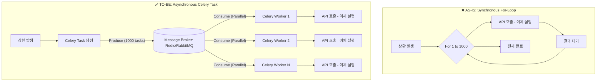

# [에잇퍼센트] Celery를 이용한 대규모 지급(이체) 처리 비동기 최적화

### 🏢 소속 / 기간
- **회사**: ㈜에잇퍼센트 (코어뱅킹팀)
- **관련 도메인**: 지급/정산 시스템 (Payout System)

### ❓ 문제 상황 (Challenge)
- **대규모 이체 발생**: P2P 금융 특성상 하나의 대출 상품에 수많은 투자자가 참여합니다. (예: 5,000만 원 대출에 5,000원씩 1,000명이 투자한 경우, 원리금 상환 시 1,000번의 이체 발생)
- **성능 및 안정성 저하**:
    - **동기식 처리의 한계**: 초기 시스템에서 `for` 문을 사용하여 순차적으로 뱅킹 API를 호출할 때 발생하는 병목 현상을 해결하고자 했습니다.

### 🔍 해결 방안 (Action)

#### 1. Celery 기반 비동기 아키텍처 도입
- **Task 분리**: 이체 요청을 생성하는 메인 로직과 실제 API를 호출하는 이체 실행 로직을 분리.
- **분산 처리**: Celery Worker를 통해 이체 작업을 백그라운드에서 병렬로 처리하여 전체 처리 속도 향상.

#### 2. 안정성 및 재시도 전략 강화
- **Idempotency (멱등성) 보장**: 동일한 이체 요청이 중복 실행되지 않도록 `transfer_id`를 기반으로 중복 체크 로직 구현.
- **자동 재시도 (Retry Mechanism)**: 일시적인 네트워크 오류 시 Celery의 `retry` 기능을 활용하여 지수 백오프(Exponential Backoff) 방식으로 재시도 수행.

#### 📊 처리 구조 변경 (Before vs After)



### 💻 코드 예시 (Python / Celery)

#### 1. 기존 동기 방식 (Pseudo Code)
```python
def process_payout_sync(payout_list):
    """기존: For 루프를 이용한 동기 API 호출"""
    for payout in payout_list:
        try:
            # 외부 뱅킹 API 호출 (Network I/O 발생)
            banking_api.request_transfer(
                amount=payout.amount,
                account_number=payout.account_number
            )
            payout.status = 'SUCCESS'
        except Exception as e:
            payout.status = 'FAILED'
            logger.error(f"Transfer failed: {payout.id}, error: {e}")
        payout.save()
```

#### 2. Celery를 이용한 비동기 방식
```python
# tasks.py
from celery import shared_task
from django.db import transaction

@shared_task(
    bind=True,
    max_retries=3,
    default_retry_delay=60  # 1분 후 재시도
)
def execute_transfer_task(self, payout_id):
    """개별 이체를 처리하는 비동기 태스크"""
    try:
        payout = Payout.objects.get(id=payout_id)
        
        # 멱등성 체크: 이미 성공한 건은 skip
        if payout.status == 'SUCCESS':
            return
            
        # 뱅킹 API 호출
        response = banking_api.request_transfer(
            transfer_id=payout.id, # 멱등키로 활용
            amount=payout.amount,
            account_number=payout.account_number
        )
        
        if response.is_success:
            payout.status = 'SUCCESS'
            payout.save()
        else:
            raise Exception("API Response Error")
            
    except Exception as exc:
        # 네트워크 오류 등 일시적 에러 시 재시도
        logger.warning(f"Retrying task for payout {payout_id}")
        raise self.retry(exc=exc)

# service.py
def process_payout_async(payout_list):
    """개별 이체 건들을 Celery 큐에 적재"""
    for payout in payout_list:
        # 각 이체 건을 비동기 태스크로 발행
        execute_transfer_task.delay(payout.id)
```

### ✨ 성과 및 결과 (Result)
- **처리 속도 대폭 향상**: 순차 처리 시 수 분 이상 소요되던 대규모 이체 작업을 Worker 병렬 처리를 통해 수 초 이내로 단축.
- **시스템 가용성 증대**: 메인 프로세스는 작업 발행 후 즉시 응답을 반환하므로 서비스 응답성이 크게 개선됨.
- **장애 대응력 강화**: 특정 이체 건의 실패가 전체 프로세스에 영향을 주지 않으며, 실패한 건만 선별하여 재시도 가능.
- **리소스 최적화**: I/O 대기 시간 동안 CPU 리소스를 점유하지 않고 효율적으로 Worker를 활용하도록 최적화.
