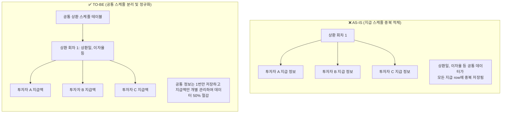

# [에잇퍼센트] 여신 시스템 ERD 구조 개선 및 리팩토링

### 🏢 소속 / 기간
- **회사**: ㈜에잇퍼센트 (코어뱅킹팀)
- **기간**: 2022.06 ~ 2023.09

### ❓ 문제 상황 (Challenge)
- **여신 시스템 내 대규모 데이터 적체**: 약 21억 건의 데이터가 쌓이면서 시스템 성능 저하 및 스토리지 비용 부담 증가.
- **P2P 금융의 복잡한 구조**: P2P 금융 특성상 **1개의 상환 스케줄(차입자)에 대해 N개의 지급 스케줄(N명의 투자자)**이 생성되는 구조입니다.
    - 예: 5,000만 원 대출 상품 하나에 1,000만 원, 500만 원, 5,000원 등 다양한 금액을 투자한 수많은 투자자가 존재.
- **데이터 중복 발생**: 동일한 상환 회차와 시점을 공유함에도 불구하고, 투자자별로 동일한 성격의 지급 데이터가 개별 row로 중복 적체되어 정합성 유지 비용과 DB 부하가 가중됨.

### 🔍 원인 분석 (Root Cause)
1. **비효율적 1:N 관계 설계**:
    - 상환과 지급 데이터가 논리적으로 분리되지 않고 하나의 비대해진 구조 안에 공존하여, 투자자가 많아질수록 데이터량이 기하급수적으로 폭증함.
2. **데이터 중복 및 정합성 위기**:
    - 동일한 이자율, 상환일 등 공통 정보를 매 지급 row마다 반복 저장함으로써 저장 공간 낭비 및 데이터 변경 시 불일치 위험 존재.

#### 📊 데이터 최적화 과정 (상환-지급 구조 개선)

### 🛠 해결 방안 (Action)
- **ERD 구조 개선**: 불필요한 중복 컬럼 및 테이블 구조를 정규화하고 최적화함.
- **리팩토링**: 복잡한 금융 로직(기한이익상실, 일부금액 중도상환 등)을 단순화하고 데이터 흐름의 추적성(Traceability)을 강화함.
    - *참고: 원리금 수취권 매매 시스템에 관한 상세 내용은 [별도 문서](8percent_right_trading_system.md)를 참조해주세요.*
- **DB 분리**: 코어 DB와 정산 DB를 분리하여 시스템 독립성 확보.

### ✨ 성과 및 결과 (Result)
- **데이터 50% 이상 절감**: 21억 건에서 10억 건 이하로 데이터 규모 축소.
- 시스템 안정성 및 운영 효율성 크게 향상.
- 온투업 법령 변화에 대한 대응 속도 개선.
