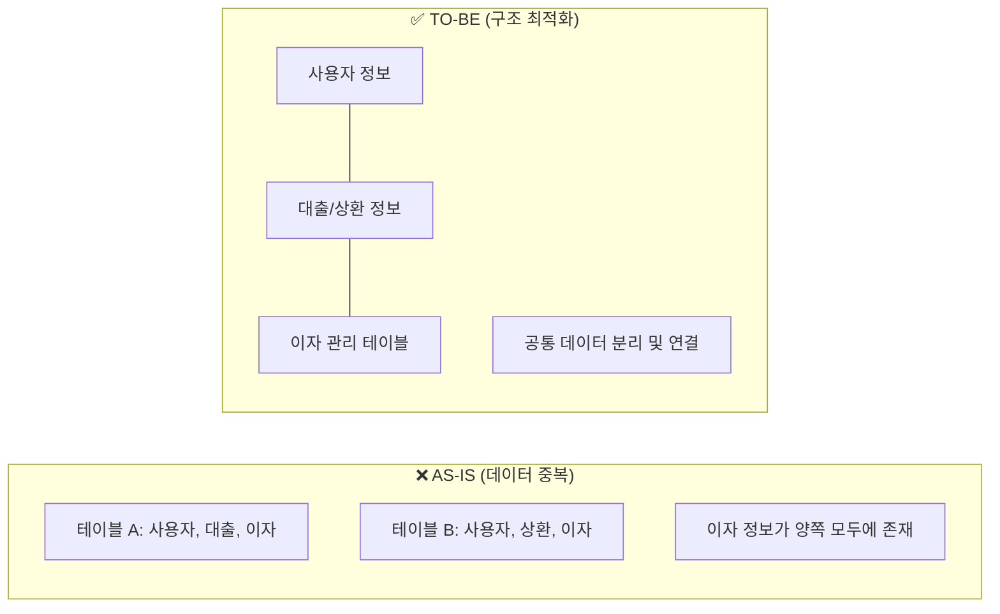

# [에잇퍼센트] 여신 시스템 ERD 구조 개선 및 리팩토링

### 🏢 소속 / 기간
- **회사**: ㈜에잇퍼센트 (코어뱅킹팀)
- **기간**: 2022.06 ~ 2023.09

### ❓ 문제 상황 (Challenge)
- 여신 시스템 내 대규모 데이터 적체로 인해 시스템 성능 저하 우려.
- 데이터 중복이 심해 관리가 어렵고 정합성 유지에 비용이 많이 발생함 (약 21억 건의 데이터).

### 🔍 원인 분석 (Root Cause)
1. **데이터 중복 및 비효율적 구조**:
    - 동일한 데이터가 여러 테이블에 흩어져 저장되어 있어, 데이터 변경 시 모든 곳을 수정해야 하는 번거로움과 데이터 불일치 위험이 큼.
    - 약 21억 건의 방대한 데이터가 쌓이면서 조회 속도가 느려지고 스토리지 비용 부담 증가.

#### 📊 데이터 최적화 과정 (정규화)

### 🛠 해결 방안 (Action)
- **ERD 구조 개선**: 불필요한 중복 컬럼 및 테이블 구조를 정규화하고 최적화함.
- **리팩토링**: 복잡한 금융 로직(원리금 수취권 매매, 기한이익상실 등)을 단순화하고 데이터 흐름의 추적성(Traceability)을 강화함.
- **DB 분리**: 코어 DB와 정산 DB를 분리하여 시스템 독립성 확보.

### ✨ 성과 및 결과 (Result)
- **데이터 50% 이상 절감**: 21억 건에서 10억 건 이하로 데이터 규모 축소.
- 시스템 안정성 및 운영 효율성 크게 향상.
- 온투업 법령 변화에 대한 대응 속도 개선.
