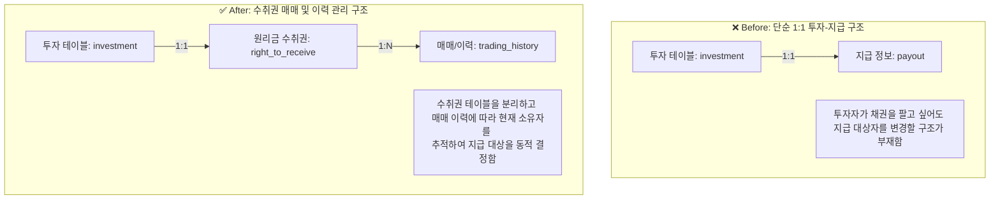

# [에잇퍼센트] P2P 원리금 수취권 매매 시스템 구축 및 유동성 개선

### 🏢 소속 / 기간
- **회사**: ㈜에잇퍼센트 (코어뱅킹팀)
- **기간**: 2022.06 ~ 2023.09

### ❓ 문제 상황 (Challenge)
- **P2P 투자의 낮은 유동성**: P2P 금융 특성상 대출이 실행되면 만기(대출 종결) 전까지 투자자는 투자금을 회수할 수 없는 구조입니다. 주식이나 펀드와 달리 중도 해지가 불가능하여 투자자의 자금이 장기간 묶이는 현상이 발생합니다.
- **투자 의사결정의 제약**: 자금이 필요할 때 즉시 현금화할 수 없다는 점은 신규 투자자의 진입 장벽이 되고, 기존 투자자의 재투자 의지를 꺾는 큰 걸림돌이 되었습니다.
- **금융 규제 및 정산의 복잡성**: 온투업법(온라인투자연계금융업법)에 따라 투자 권리 관계가 명확해야 하며, 권리 이전 시 빌링 시스템과의 정합성 유지가 필수적이었습니다.

### 🔍 해결 방안 (Action)

#### 1. "원리금 수취권" 개념 도입 및 시스템화
- **원리금 수취권(Right to Receive Principal and Interest)**: P2P 대출로부터 발생하는 원금과 이자를 받을 수 있는 권리를 정의하고, 이를 디지털 자산화하여 매매가 가능한 단위로 설계했습니다.
- **권리 이전 로직 설계**: 기존 투자자(판매자)와 신규 투자자(구매자) 간의 권리 이동을 시스템적으로 처리하는 로직을 구축했습니다.

#### 2. ERD 구조 개선 및 빌링 시스템 연계
- **매매 가능 구조로의 스키마 확장**: 기존의 '투자-지급' 1:1 매칭 구조를 탈피하여, 하나의 투자 건에 대해 소유권(수취권)이 여러 번 이전될 수 있도록 이력 관리 테이블을 설계했습니다.
- **자금 흐름 정합성 확보**: 수취권 매매 시 빌링 시스템과 연동하여 판매자에게는 매매 대금을 정산하고, 구매자에게는 향후 발생하는 상환금을 지급하는 자동 정산 프로세스를 구현했습니다.

#### 📊 샘플 ERD 설계 (Before & After)

### 💻 기술적 성과 (Technical Achievement)
- **데이터 정합성 보장**: 수만 건의 매매 트랜잭션 상황에서도 원리금 계산 로직의 무결성을 유지하고, 소유권 이전 시점과 상환금 지급 대상의 일치 여부를 검증하는 로직을 강화했습니다.
- **유연한 ERD 설계**: 향후 다양한 형태의 채권 매매나 분할 매매로 확장 가능한 유연한 데이터 모델을 구축했습니다.
- **빌링 시스템 연동 최적화**: 매매 즉시 포인트 정산이 이루어지도록 비동기 메시징 및 트랜잭션 처리를 최적화했습니다.

### ✨ 성과 및 결과 (Result)
- **P2P 투자 유동성 확보**: 투자자가 만기 전에도 자산을 현금화할 수 있는 통로를 마련하여 서비스 만족도 및 재투자율 향상.
- **신규 투자 유입 증가**: 유동성 리스크가 해소됨에 따라 고액 투자자 및 신규 유저의 투자 접근성이 개선됨.
- **운영 효율성 증대**: 수동으로 처리하던 권리 양수도 계약 및 정산 과정을 100% 시스템 자동화하여 운영 리소스 절감.
- **법적 준거성 확보**: 온투업법 가이드라인에 맞춘 투명한 권리 거래 이력 관리 체계 구축.
