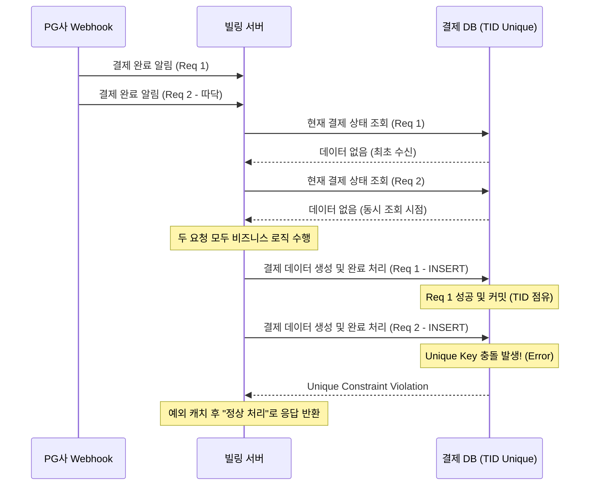

# [페이레터/블루월넛] PG 웹훅(Webhook) 중복 호출 방지 및 동시성 제어

### 🏢 소속 / 기간
- **회사**: 페이레터㈜, ㈜블루월넛
- **관련 도메인**: 빌링(Billing), 결제 플랫폼

### ❓ 문제 상황 (Challenge)
- **웹훅 중복 호출 (따닥)**: PG사로부터 결제 완료 통지(Webhook)가 네트워크 지연이나 재시도 로직으로 인해 거의 동시에 두 번 이상 호출되는 현상 발생.
- **데이터 부정합 및 중복 지급**: 동일한 결제 건에 대해 충전(캐시/포인트)이 중복으로 처리되거나, 주문 상태가 비정상적으로 변경되는 리스크 존재.
- **DB 락의 한계**: 단순히 DB 트랜잭션과 유니크 키만으로는 아주 짧은 찰나에 들어오는 동시 요청을 완벽히 방어하기 어렵거나, DB 부하를 가중시킬 수 있음.

### 🛠 해결 방안 (Action)
분산 환경에서도 데이터 정합성을 보장하기 위해 **DB Unique 제약 조건**과 **멱등성(Idempotency)** 기반의 로직으로 해결했습니다.

#### 1. DB Unique 제약 조건 활용
- **원리**: 결제 테이블의 결제 고유 번호(TID)에 `UNIQUE` 인덱스를 설정하여, 애플리케이션 계층의 동시 요청이 DB에 반영되는 최종 단계에서 물리적으로 중복 생성을 차단합니다.
- **락(Lock) 관점에서의 이해**: 
    - 명시적인 `SELECT ... FOR UPDATE` 같은 비관적 락을 사용하지 않더라도, DB 엔진은 `UNIQUE` 인덱스 정합성을 유지하기 위해 내부적으로 인덱스 페이지에 대한 래치(Latch)나 배타적 잠금을 수행합니다.
    - 결과적으로 **TID라는 유일한 식별자를 키(Key)로 하는 물리적 락**이 걸리는 효과를 얻게 되어, 찰나의 순간에 들어오는 중복 요청을 원천 봉쇄합니다.
- **비관적 락 대비 장점 (상세 예시)**:
    1. **필요한 순간에만 발생 (성능 최적화)**:
        - **비관적 락**: 웹훅이 들어오자마자 `SELECT ... FOR UPDATE`를 걸면, 로직이 수행되는 동안 다른 관리자 화면이나 통계 쿼리에서 해당 레코드를 읽으려 할 때 대기(Wait)가 발생할 수 있습니다.
        - **TID 유니크 방식**: 데이터를 조회할 때는 아무런 락을 걸지 않습니다. 오직 DB에 값을 써넣는 **최종 결정의 순간(Commit/Flush)**에만 정합성을 체크하므로, 시스템 전반의 읽기 성능(Throughput)이 저하되지 않습니다.
    2. **데드락(Deadlock) 위험 감소 (안정성)**:
        - **복잡한 락 시나리오**: 만약 `사용자 잔액`과 `결제 내역` 테이블을 서로 다른 순서로 점유하려 할 때(A가 사용자 락 획득 후 결제 락 대기, B가 결제 락 획득 후 사용자 락 대기) 데드락이 발생할 수 있습니다.
        - **TID 유니크 방식**: 여러 자원을 복잡하게 선점하지 않고, 오직 `TID`라는 단일 키의 충돌 여부만 판단합니다. 자원 점유 경쟁이 단순해지므로 시스템 전반의 데드락 발생 가능성이 획기적으로 낮아집니다.
- **장점**: 별도의 외부 인프라(Redis 등) 없이도 가장 확실하게 데이터 무결성을 보장할 수 있습니다.

#### 2. 상태 체크를 통한 멱등성(Idempotency) 보장
- **로직**: 웹훅 수신 시 가장 먼저 해당 TID를 키로 하여 **현재 결제 진행 상태(status)**를 조회합니다.
    - **데이터가 이미 존재하는 경우**: 비즈니스적으로 `COMPLETED`(완료) 등 이미 최종 처리가 끝난 상태인지를 확인하여 중복 처리를 방지합니다.
    - **데이터가 없는 경우 (최초 수신)**: 새로운 결제 레코드를 생성(INSERT)할 준비를 합니다. 이때 동시 요청이 들어오면 두 요청 모두 "데이터 없음"으로 판단하고 진행할 수 있습니다.
- **예외 처리 (핵심)**: 동시 요청으로 인해 두 요청이 동시에 `INSERT`를 시도할 때, DB의 **UNIQUE 제약 조건**이 물리적으로 한 건만 허용하고 나머지는 차단합니다. 늦게 온 요청은 `Unique Constraint Violation` 예외가 발생하며, 이를 캐치하여 중복 알림을 발송하고 사용자에게는 성공 응답을 보냅니다.

#### 📊 DB 제약 조건을 이용한 중복 방어 흐름


### 💻 코드 예시 (Java / Spring Data JPA)

```java
@Service
@RequiredArgsConstructor
@Slf4j
public class WebhookService {
    private final PaymentRepository paymentRepository;
    private final NotificationService notificationService;

    @Transactional
    public void processWebhook(String tid, PaymentData data) {
        try {
            // 1. 멱등성 체크: 이미 처리된 결제인지 확인
            Payment payment = paymentRepository.findByTid(tid)
                    .orElseThrow(() -> new IllegalArgumentException("NOT_FOUND"));

            if (payment.isCompleted()) {
                log.info("이미 완료된 결제 건입니다. TID: {}", tid);
                return;
            }

            // 2. 실제 비즈니스 로직 수행 (상태 변경 및 충전 등)
            // DB 레벨의 UNIQUE 제약 조건에 의해 동시 요청 시 한 건만 성공함
            payment.complete(data);
            paymentRepository.saveAndFlush(payment);

        } catch (DataIntegrityViolationException e) {
            // 3. 중복 키 예외 발생 시 (동시 요청 상황)
            log.warn("중복된 웹훅 요청이 감지되었습니다. (Unique Constraint Violation) TID: {}", tid);
            
            // 4. 장애 대응 및 모니터링을 위한 알림 발송 (Slack 등)
            notificationService.sendAlert("웹훅 중복 감지 - TID: " + tid);
            
            // 이미 먼저 온 요청이 처리 중이거나 완료되었으므로, 
            // 호출자(PG)에게는 성공 응답을 주어 재시도를 방지함
        }
    }
}
```

### ✨ 성과 및 결과 (Result)
- **중복 결제 사고 제로(Zero)**: 초당 수백 건의 웹훅이 몰리는 상황에서도 DB 제약 조건을 활용해 데이터 정합성을 완벽히 유지.
- **인프라 비용 효율화**: 별도의 캐시 서버(Redis)를 구축/운영하지 않고도 DB의 핵심 기능을 활용하여 동시성 이슈 해결.
- **시스템 안정성 및 모니터링 강화**: 예외 핸들링을 통한 멱등성 보장으로 PG사의 재시도 요청을 효과적으로 제어하고, 실시간 알림 연동을 통해 중복 요청 발생 현황을 즉각적으로 파악하여 운영 리소스 절감.
