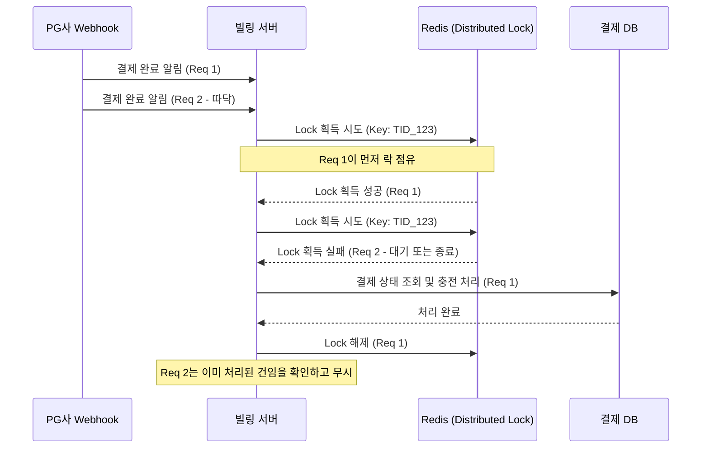

# [페이레터/블루월넛] PG 웹훅(Webhook) 중복 호출 방지 및 동시성 제어

### 🏢 소속 / 기간
- **회사**: 페이레터㈜, ㈜블루월넛
- **관련 도메인**: 빌링(Billing), 결제 플랫폼

### ❓ 문제 상황 (Challenge)
- **웹훅 중복 호출 (따닥)**: PG사로부터 결제 완료 통지(Webhook)가 네트워크 지연이나 재시도 로직으로 인해 거의 동시에 두 번 이상 호출되는 현상 발생.
- **데이터 부정합 및 중복 지급**: 동일한 결제 건에 대해 충전(캐시/포인트)이 중복으로 처리되거나, 주문 상태가 비정상적으로 변경되는 리스크 존재.
- **DB 락의 한계**: 단순히 DB 트랜잭션과 유니크 키만으로는 아주 짧은 찰나에 들어오는 동시 요청을 완벽히 방어하기 어렵거나, DB 부하를 가중시킬 수 있음.

### 🛠 해결 방안 (Action)
분산 환경에서도 안정적으로 동시성을 제어하기 위해 **Redis 분산 락(Distributed Lock)**과 **멱등성 키(Idempotency Key)**를 결합하여 해결했습니다.

#### 1. Redis 분산 락 (Redisson 활용)
- **원리**: 결제 고유 번호(TID 등)를 키로 사용하여 Redis에 락을 획득한 요청만 로직을 수행하도록 제한.
- **장점**: DB에 쿼리를 날리기 전 어플리케이션 계층에서 1차적으로 중복 요청을 차단하여 DB 부하 감소 및 처리 속도 향상.
- **Redisson 채택 이유**: Pub/Sub 기반의 락 구현으로 스핀 락(Spin Lock) 방식보다 Redis 부하가 적고, 락의 만료 시간을 안전하게 관리할 수 있음.

#### 2. 멱등성(Idempotency) 보장
- **Unique Key 설정**: 결제 테이블의 결제 고유 번호(TID)에 `UNIQUE` 제약 조건을 설정하여, 분산 락이 만에 하나 실패하더라도 DB 수준에서 최종적으로 중복 데이터 생성을 방지.
- **상태 체크**: 로직 시작 시 해당 결제 건이 이미 처리되었는지(Status 확인) 먼저 조회하여 중복 처리를 방지.

#### 📊 분산 락을 이용한 웹훅 처리 흐름


### 💻 코드 예시 (Java / Redisson)

```java
@Service
@RequiredArgsConstructor
public class WebhookService {
    private final RedissonClient redissonClient;
    private final PaymentRepository paymentRepository;

    public void processWebhook(String tid, PaymentData data) {
        String lockKey = "LOCK:PAYMENT:" + tid;
        RLock lock = redissonClient.getLock(lockKey);

        try {
            // 1. 락 획득 시도 (최대 5초 대기, 10초 후 자동 해제)
            if (lock.tryLock(5, 10, TimeUnit.SECONDS)) {
                try {
                    // 2. 멱등성 체크: 이미 처리된 결제인지 확인
                    if (paymentRepository.existsByTidAndStatus(tid, Status.COMPLETED)) {
                        log.info("이미 처리된 결제 건입니다. TID: {}", tid);
                        return;
                    }

                    // 3. 실제 비즈니스 로직 수행 (충전, 상태 변경 등)
                    executePaymentCompletion(tid, data);
                    
                } finally {
                    lock.unlock(); // 락 해제
                }
            } else {
                log.warn("락 획득 실패 - 중복 요청 가능성 있음. TID: {}", tid);
            }
        } catch (InterruptedException e) {
            Thread.currentThread().interrupt();
        }
    }
}
```

### ✨ 성과 및 결과 (Result)
- **중복 결제 사고 제로(Zero)**: 초당 수백 건의 웹훅이 몰리는 상황에서도 데이터 부정합 및 중복 충전 이슈를 완벽히 해결.
- **시스템 안정성 향상**: DB 트랜잭션 격리 수준에 의존하지 않고도 어플리케이션 계층에서 동시성을 제어하여 DB 데드락(Deadlock) 위험 감소.
- **운영 신뢰도 확보**: 결제 시스템의 가장 민감한 이슈인 '중복 결제'를 원천 차단하여 대외 고객사와의 신뢰 관계 강화.
