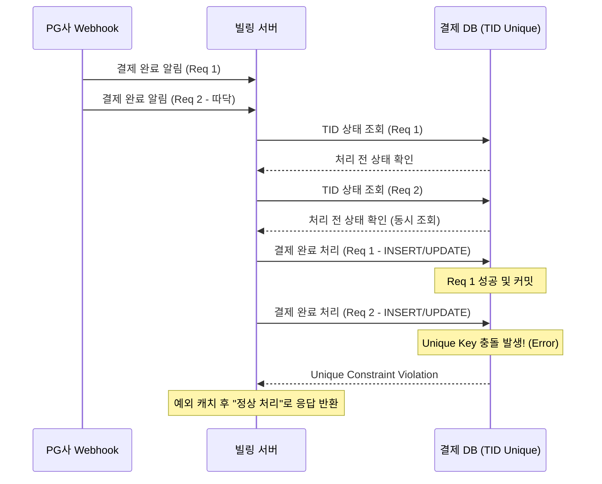

# [페이레터/블루월넛] PG 웹훅(Webhook) 중복 호출 방지 및 동시성 제어

### 🏢 소속 / 기간
- **회사**: 페이레터㈜, ㈜블루월넛
- **관련 도메인**: 빌링(Billing), 결제 플랫폼

### ❓ 문제 상황 (Challenge)
- **웹훅 중복 호출 (따닥)**: PG사로부터 결제 완료 통지(Webhook)가 네트워크 지연이나 재시도 로직으로 인해 거의 동시에 두 번 이상 호출되는 현상 발생.
- **데이터 부정합 및 중복 지급**: 동일한 결제 건에 대해 충전(캐시/포인트)이 중복으로 처리되거나, 주문 상태가 비정상적으로 변경되는 리스크 존재.
- **DB 락의 한계**: 단순히 DB 트랜잭션과 유니크 키만으로는 아주 짧은 찰나에 들어오는 동시 요청을 완벽히 방어하기 어렵거나, DB 부하를 가중시킬 수 있음.

### 🛠 해결 방안 (Action)
분산 환경에서도 데이터 정합성을 보장하기 위해 **DB Unique 제약 조건**과 **멱등성(Idempotency)** 기반의 로직으로 해결했습니다.

#### 1. DB Unique 제약 조건 활용
- **원리**: 결제 테이블의 결제 고유 번호(TID)에 `UNIQUE` 인덱스를 설정하여, 애플리케이션 계층의 동시 요청이 DB에 반영되는 최종 단계에서 물리적으로 중복 생성을 차단합니다.
- **장점**: 별도의 외부 인프라(Redis 등) 없이도 가장 확실하게 데이터 무결성을 보장할 수 있습니다.

#### 2. 상태 체크를 통한 멱등성(Idempotency) 보장
- **로직**: 웹훅 수신 시 가장 먼저 해당 TID의 상태를 조회합니다.
    - 이미 `COMPLETED` 상태라면 즉시 종료(Success 응답 반환).
    - 처리 중이거나 대기 상태일 때만 비즈니스 로직을 수행합니다.
- **예외 처리**: 동시 요청 시 먼저 커밋된 요청이 성공하고, 늦게 온 요청은 `Unique Constraint Violation` 예외가 발생합니다. 이때 해당 예외를 캐치하여 사용자에게는 성공 응답을 보내되 내부적으로 중복 처리는 무시하도록 설계했습니다.

#### 📊 DB 제약 조건을 이용한 중복 방어 흐름


### 💻 코드 예시 (Java / Spring Data JPA)

```java
@Service
@RequiredArgsConstructor
@Slf4j
public class WebhookService {
    private final PaymentRepository paymentRepository;

    @Transactional
    public void processWebhook(String tid, PaymentData data) {
        try {
            // 1. 멱등성 체크: 이미 처리된 결제인지 확인
            Payment payment = paymentRepository.findByTid(tid)
                    .orElseThrow(() -> new IllegalArgumentException("NOT_FOUND"));

            if (payment.isCompleted()) {
                log.info("이미 완료된 결제 건입니다. TID: {}", tid);
                return;
            }

            // 2. 실제 비즈니스 로직 수행 (상태 변경 및 충전 등)
            // DB 레벨의 UNIQUE 제약 조건에 의해 동시 요청 시 한 건만 성공함
            payment.complete(data);
            paymentRepository.saveAndFlush(payment);

        } catch (DataIntegrityViolationException e) {
            // 3. 중복 키 예외 발생 시 (동시 요청 상황)
            log.warn("중복된 웹훅 요청이 감지되었습니다. (Unique Constraint Violation) TID: {}", tid);
            // 이미 먼저 온 요청이 처리 중이거나 완료되었으므로, 
            // 호출자(PG)에게는 성공 응답을 주어 재시도를 방지함
        }
    }
}
```

### ✨ 성과 및 결과 (Result)
- **중복 결제 사고 제로(Zero)**: 초당 수백 건의 웹훅이 몰리는 상황에서도 DB 제약 조건을 활용해 데이터 정합성을 완벽히 유지.
- **인프라 비용 효율화**: 별도의 캐시 서버(Redis)를 구축/운영하지 않고도 DB의 핵심 기능을 활용하여 동시성 이슈 해결.
- **시스템 안정성 확보**: 예외 핸들링을 통한 멱등성 보장으로 PG사의 재시도 요청을 효과적으로 제어하고 운영 리소스 절감.
