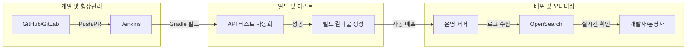

# [블루월넛] 배포 자동화(CI/CD) 및 통합 로그 시스템 구축

### 🏢 소속 / 기간
- **회사**: ㈜블루월넛 (Payment Platform 개발팀)
- **기간**: 2025.03 ~ 2026.02

### ❓ 문제 상황 (Challenge)
- 기존 SVN 기반의 수동 배포 프로세스로 인한 개발 생산성 저하 및 휴먼 에러 위험.
- 분산된 서버 로그로 인해 장애 발생 시 원인 파악 및 모니터링에 많은 시간 소요.
- **보안 및 감사 리스크**: 개발자가 로그 확인이나 배포를 위해 서버에 직접 접속하는 행위가 보안상 감사 대상이었으며, 운영 환경의 접근 제어 및 이력 관리 필요성 증대.

### 🛠 해결 방안 (Action)
- **CI/CD 환경 이관 및 자동화**: 
    - 형상 관리 도구를 SVN에서 Git으로 전환.
    - 빌드 도구를 **ANT에서 Gradle**로 교체하여 빌드 속도 및 의존성 관리 효율성 개선.
    - **Jenkins 파이프라인 스크립트** 및 **GitHub Actions**를 구축하여 빌드, 테스트, 배포 전 과정 자동화.
- **Java 1.7 → JDK 17 업그레이드**:
    - 10년 이상 된 레거시 환경(Java 1.7)을 최신 롱텀 서포트(LTS) 버전인 JDK 17로 마이그레이션.
    - 모던 자바 문법(Stream API, Lambda, Records 등) 도입 기반 마련 및 런타임 성능 개선.
- **테스트 커버리지 확보**: 테스트 코드가 부재했던 기존 프로젝트에 **모든 API에 대한 테스트 코드**를 적용하여 코드 안정성 확보.
- **배치 작업 스케줄러 전환**:
    - 기존 리눅스 서버의 **crontab**으로 관리되던 분산된 배치 작업들을 **Spring Scheduler**(@Scheduled)로 통합 관리하도록 개선.
    - 애플리케이션 내부에서 스케줄링을 제어함으로써 관리 포인트 일원화 및 모니터링 편의성 증대.
- **통합 로그 시스템 구축**: OpenSearch를 도입하여 여러 서버에 흩어진 로그를 하나로 통합하고 대시보드 구축.

#### 📊 CI/CD 배포 자동화 흐름

### ✨ 성과 및 결과 (Result)
- **배포 및 운영 효율성 극대화**: 수동 스크립트 실행을 위한 **서버 접속 빈도를 90% 이상 절감**하고, 배포 주기 단축 및 휴먼 에러 원천 차단.
- **보안성 및 컴플라이언스 준수**: 서버 직접 접속을 최소화하여 보안 감사 리스크를 해소하고, 시스템을 통한 자동화된 배포 및 로그 관리 체계 구축.
- **최신 기술 스택 확보**: **Java 1.7에서 JDK 17로 업그레이드**하여 보안 취약점 해결 및 애플리케이션 성능 향상.
- **시스템 안정성 강화**: API 테스트 자동화 및 인프라 현대화를 통해 서비스 운영 안정성 확보.
- **기술 부채 청산**: 레거시 빌드 도구(ANT)와 형상 관리 시스템을 최신화하고, **crontab을 Spring Scheduler로 전환**하여 운영 효율성 향상.
- **모니터링 체계 고도화**: OpenSearch 기반의 로그 통합으로 **서버 직접 접속 없이 실시간 로그 확인 및 분석 가능**, 장애 대응 효율성 대폭 증대.
