# [블루월넛] 레거시 프레임워크 버전 업 및 메모리 누수 최적화

### 🏢 소속 / 기간
- **회사**: ㈜블루월넛 (Payment Platform 개발팀)
- **기간**: 2025.03 ~ 2026.02

### ❓ 문제 상황 (Challenge)
- 현대오토에버 자체 프레임워크의 레거시 버전을 최신화하고 **Java 버전을 1.7에서 JDK 17로 업그레이드**하는 과정에서 시스템 불안정성 발생.
- **Jennifer(제니퍼)** 모니터링 중 서버 가동 시간이 경과함에 따라 Heap Memory 사용량이 지속적으로 증가하는 메모리 누수 현상 발견.
- 특정 시점 이후 Full GC가 빈번하게 발생하며 시스템 응답 속도가 급격히 저하됨.
    - **분석 결과**: Full GC 수행 후에도 회수되지 않고 남아있는 잔여 메모리량이 계단식으로 계속해서 늘어나는 전형적인 메모리 누수 구조 확인.

### 🛠 해결 방안 (Action)
- **원인 분석**: 인프라팀과 협업하여 **Heap Dump**를 생성하고 **Eclipse MAT(Memory Analyzer Tool)**을 활용하여 분석 수행.
- **핵심 문제 발견**: `SqlSession` 객체가 수만 개 이상 소멸되지 않고 Heap 영역을 점유하고 있음을 확인.
- **코드 추적**: 자체 프레임워크 내부에서 `SqlSessionFactory`가 오버라이드되어 있었으며, Spring의 Bean 생명주기(Lifecycle)와 연동되지 않아 세션이 자동으로 닫히지 않는 구조임을 파악.
- **시스템 개선**: 
    - 오버라이드된 레거시 Factory 클래스를 제거.
    - Mybatis-Spring 표준 라이브러리인 `SqlSessionFactoryBean`과 `SqlSessionTemplate`을 도입하여 Spring Container가 세션의 생명주기와 트랜잭션을 관리하도록 설정을 현대화.

### 💡 지식 공유: SqlSessionFactory & SqlSession 라이프 사이클
Mybatis의 핵심 객체들은 각기 다른 스코프와 생명주기를 가집니다. 이를 잘못 관리하면 이번 사례와 같은 메모리 누수가 발생합니다.

#### 📊 SqlSession 관리 흐름도 (Mermaid)

```mermaid
graph TD
    subgraph "❌ AS-IS: 레거시 수동 관리"
        A[클라이언트 요청] --> B[LegacySqlSessionFactory]
        B --> C{openSession 호출}
        C --> D[SqlSession 생성]
        D --> E[쿼리 실행]
        E --> F[메서드 종료]
        F -- "⚠️ close() 누락" --> G[Heap 메모리 누적]
        G --> H[Full GC 발생 / 메모리 누수]
    end

    subgraph "✅ TO-BE: Spring 관리 (SqlSessionTemplate)"
        I[클라이언트 요청] --> J[SqlSessionTemplate]
        J --> K[SqlSessionFactory]
        K --> L[SqlSession 생성]
        L --> M[쿼리 실행]
        M --> N[트랜잭션 동기화 / 종료]
        N -- "✨ 자동 반납 (Close)" --> O[메모리 해제]
        O --> P[안정적인 Heap 메모리 유지]
    end
```



1. **SqlSessionFactoryBuilder**: `SqlSessionFactory`를 생성한 후 바로 폐기되어야 합니다. (Method Scope)
2. **SqlSessionFactory**: 애플리케이션 실행 동안 하나만 존재해야 하며, 세션을 생성하는 공장 역할을 합니다. (Application Scope)
3. **SqlSession**: 각 요청이나 트랜잭션마다 생성되고, **사용 후 반드시 닫아야(close) 합니다.** (Request/Thread Scope)
    - ❌ **문제의 원인**: 레거시 프레임워크는 `SqlSession`을 수동으로 열었으나, Spring의 관리 밖에서 동작하여 자동으로 닫히지 않고 Heap에 누적되었습니다.
4. **SqlSessionTemplate (Spring 연동)**: Spring과 연동할 때 사용되며, 내부적으로 쓰레드 안전(Thread-safe)하게 세션을 관리하고 **자동으로 세션을 닫아주어** 메모리 누수를 원천 차단합니다.

### 💻 코드 분석 (Code Analysis)

#### ❌ AS-IS (문제의 레거시 코드)
Spring의 관리를 벗어나 수동으로 세션을 생성하고 있었으며, 명시적인 close 로직이 누락되어 있었습니다.

```java
// Custom SqlSessionFactory가 Spring의 Bean 생명주기를 따르지 않음
public class LegacySqlSessionFactory extends DefaultSqlSessionFactory {
    @Override
    public SqlSession openSession() {
        // 세션을 열기만 하고, 자동으로 닫히는 로직이 누락됨
        // Jennifer 모니터링 결과, 여기서 생성된 SqlSession 객체들이 소멸되지 않고 Heap에 누적됨
        return super.openSession();
    }
}
```

#### ✅ TO-BE (개선된 표준화 코드)
Spring의 의존성 주입(DI)과 관리를 받도록 설정하여 세션 누수를 원천 차단했습니다.

```java
@Configuration
@MapperScan(basePackages = "com.bluewalnut.mapper")
public class MybatisConfig {
    @Bean
    public SqlSessionFactory sqlSessionFactory(DataSource dataSource) throws Exception {
        SqlSessionFactoryBean sessionFactory = new SqlSessionFactoryBean();
        sessionFactory.setDataSource(dataSource);
        // Spring managed transaction 및 session 생명주기 준수
        return sessionFactory.getObject();
    }

    @Bean
    public SqlSessionTemplate sqlSessionTemplate(SqlSessionFactory sqlSessionFactory) {
        // SqlSessionTemplate은 쓰레드 안전하며, 사용 후 자동으로 세션을 닫아줌
        return new SqlSessionTemplate(sqlSessionFactory);
    }
}
```

### ✨ 성과 및 결과 (Result)
- **메모리 안정화**: 개선 후 Heap Memory 사용량이 일정 수준을 유지하며 메모리 누수 문제 완벽 해결.
- **시스템 가용성 증대**: Full GC 빈도 감소로 인한 서비스 응답 속도 안정화 및 런타임 안정성 확보.
- **기술 부채 청산**: 비표준 오버라이드 코드를 표준 라이브러리로 대체하여 유지보수성 및 확장성 향상.
- **분석 역량 입증**: Jennifer와 Eclipse MAT 등 전문 도구를 활용한 데이터 기반의 트러블슈팅 프로세스 정립.
