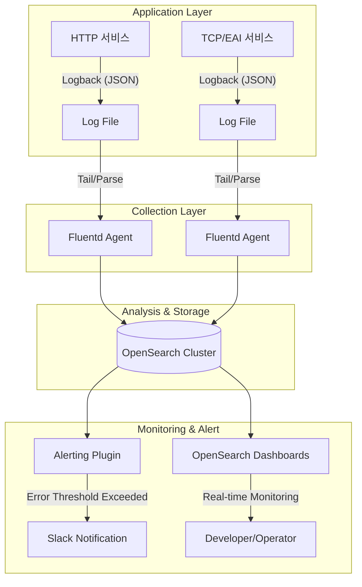

# [블루월넛] OpenSearch 로그 포맷 공통화 및 통합 모니터링 체계 구축

### 🏢 소속 / 기간
- **회사**: ㈜블루월넛 (Payment Platform 개발팀)
- **기간**: 2025.03 ~ 2026.02

### ❓ 문제 상황 (Challenge)
- **로그 파편화**: 서비스별로 로그 포맷이 상이하여(HTTP, TCP/IP, EAI 등) 통합 분석 및 검색에 어려움이 있었음.
- **보안 감사 리스크**: 모든 개발자가 실시간 로그 확인을 위해 운영 서버에 직접 터미널(SSH)로 접속해야 했으며, 이는 금융권 보안 감사 대상이자 휴먼 에러의 잠재적 원인이 됨.
- **장애 인지 지연**: 텍스트 기반의 로그를 수동으로 확인하다 보니, 특정 API의 에러율 급증이나 응답 지연 등의 징후를 실시간으로 파악하기 어려웠음.

### 🛠 해결 방안 (Action)

#### 1. 로그 포맷 표준화 및 공통화
- 서비스 특성에 맞는 표준 Index 포맷을 설계하고 사내 공통 스펙으로 제공함.
    - **HTTP**: Method, URL, Status Code, Response Time, User-Agent 등.
    - **TCP/IP**: Source/Dest IP, Port, Payload Length 등.
    - **EAI (Interface)**: Interface ID, System Code, Success/Fail Flag, Error Message 등.

#### 2. 수집 및 전송 아키텍처 구축
- **Logback 설정 공유**: 어플리케이션 계층에서 표준 포맷으로 로그를 남길 수 있도록 가이드를 제작하고 공통 라이브러리/설정(ConsoleAppender, FileAppender)을 배포함.
- **Fluentd 에이전트 도입**: 각 서버에 Fluentd를 설치하여 실시간으로 로그 파일을 읽어(Tail) OpenSearch로 안전하게 전송하도록 구성함.

#### 3. Fluentd 설정 및 Index 샘플
구체적인 수집 설정과 인덱스 매핑 스펙을 사내 공통 가이드로 배포하여 데이터 정합성을 확보함.

##### 🔧 Fluentd Configuration (Sample)
```apache
# 1. 로그 소스 정의 (Tail)
<source>
  @type tail
  path /app/logs/application-json.log
  pos_file /var/log/td-agent/app-log.pos
  tag app.http.logs
  <parse>
    @type json # Logback에서 생성한 JSON 포맷 파싱
    time_key timestamp
    time_format %Y-%m-%dT%H:%M:%S.%L%z
  </parse>
</source>

# 2. 필터링 및 데이터 가공
<filter app.**>
  @type record_transformer
  <record>
    hostname "#{Socket.gethostname}" # 서버 호스트 정보 추가
    service_name "payment-api"       # 서비스 식별값 추가
  </record>
</filter>

# 3. OpenSearch 전송 (Match)
<match app.**>
  @type opensearch
  hosts https://opensearch-cluster:9200
  user admin
  password password
  index_name log-bluewalnut-%Y.%m.%d
  <buffer>
    flush_interval 5s # 5초 단위로 벌크 전송
  </buffer>
</match>
```

##### 📊 OpenSearch Index Mapping (Sample)
```json
{
  "mappings": {
    "properties": {
      "timestamp": { "type": "date" },
      "hostname": { "type": "keyword" },
      "service_name": { "type": "keyword" },
      "method": { "type": "keyword" },      // HTTP Method
      "url": { "type": "keyword" },         // Request URL
      "status_code": { "type": "integer" }, // HTTP 상태 코드
      "response_time": { "type": "float" }, // 응답 속도 (ms)
      "interface_id": { "type": "keyword" },// EAI 인터페이스 ID
      "error_message": { "type": "text" }   // 에러 상세 내용
    }
  }
}
```

#### 4. 모니터링 대시보드 및 알림 연동
- **OpenSearch Dashboards**: 시각화 도구를 활용하여 주요 지표를 한눈에 볼 수 있는 통합 대시보드 구축.
- **장애 알림**: 특정 임계치(예: HTTP 500 에러 분당 10건 이상) 초과 시 슬랙(Slack) 등 메신저로 즉시 알림이 발송되도록 연동.

### 📊 로그 수집 및 모니터링 흐름도



### 📈 모니터링 활용 예시 (TO-BE)

| 모니터링 항목 | 상세 내용 (예시) |
| :--- | :--- |
| **에러율 추적** | HTTP 상태 코드가 `200`이 아닌 건수의 실시간 비중 및 급증 알림 |
| **성능 분석** | 상위 5개 느린 API(Response Time P99) 식별 및 지연 원인 분석 |
| **트래픽 패턴** | 시간대별 접속량 및 IP별 요청 횟수 분석을 통한 이상 징후 감지 |
| **비즈니스 지표** | EAI 인터페이스 성공률 및 특정 대외 기관 장애 여부 즉시 파악 |

### ✨ 성과 및 결과 (Result)
- **운영 효율성 극대화**: 서버 직접 접속 빈도를 95% 이상 제거하여 보안 감사 리스크를 원천적으로 해소함.
- **장애 대응 시간(MTTR) 단축**: 대시보드를 통한 직관적인 장애 인지로 이슈 발생부터 원인 분석까지 소요되는 시간을 대폭 단축함.
- **사내 기술 표준 수립**: 로그 포맷 공통화를 통해 부서 간 협업 시 데이터 해석의 오차를 줄이고 시스템 통합 용이성 확보.
- **보안성 강화**: 서버 접속 권한을 엄격히 제한하고 로그 열람 권한을 시스템을 통해 관리함으로써 내부 통제 강화.
