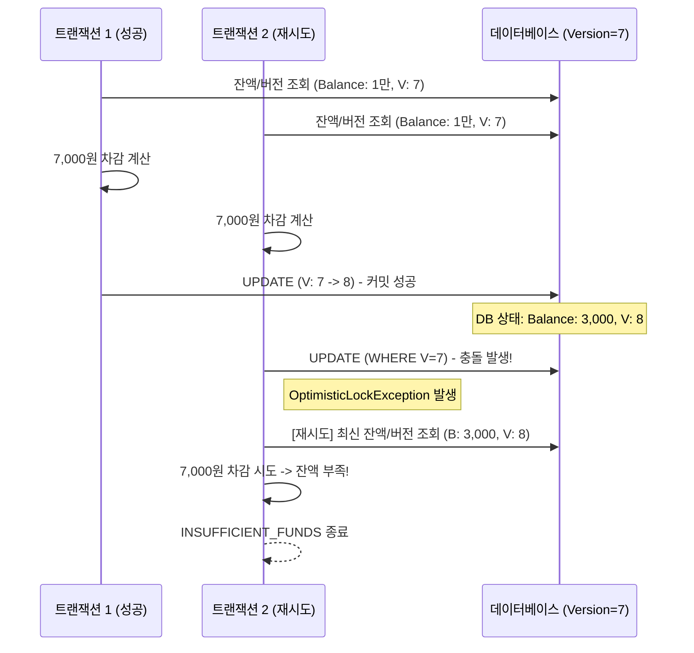

# [에잇퍼센트/페이레터] 낙관적 락(Optimistic Lock)을 이용한 결제 동시성 제어

### 🏢 소속 / 기간
- **회사**: ㈜에잇퍼센트, 페이레터㈜
- **관련 도메인**: 코어뱅킹(계좌 잔액), 빌링(캐시 잔액)

### ❓ 문제 상황 (Challenge)
- **동시성 이슈**: 대규모 트래픽이 발생하는 결제/출금 시스템에서 동일한 계정(Account)에 대해 거의 동시에 여러 건의 차감 요청이 들어올 경우, 데이터 정합성이 깨질 위험이 있음.
- **Race Condition**: 두 트랜잭션이 동시에 잔액을 읽고 수정할 때, 나중에 커밋된 데이터가 먼저 커밋된 데이터를 덮어쓰는 **Lost Update** 현상이 발생하여 마이너스 잔액이 되거나 데이터가 누락될 수 있음.

### 🛠 해결 방안 (Action)
- **낙관적 락(Optimistic Lock) 도입**: DB 수준의 물리적인 락(Pessimistic Lock) 대신, 어플리케이션 수준에서 버전 정보를 관리하여 충돌을 감지하는 낙관적 락을 적용.
- **낙관적 락 vs 비관적 락 비교 및 채택 이유**:
    - **비관적 락(Pessimistic Lock)**: `SELECT ... FOR UPDATE` 등을 사용하여 DB 수준에서 데이터 점유. 충돌이 잦은 경우 유리하지만, 락 대기 시간으로 인해 성능(Throughput)이 저하될 수 있음.
    - **낙관적 락(Optimistic Lock)**: 버전 정보를 활용해 충돌을 감지. 데이터 수정 시점에만 확인하므로 DB 부하가 적고 시스템 가용성이 높음.
    - **채택 이유**: 결제 시스템 특성상 동일 계정에 대한 동시 요청 빈도가 아주 높지는 않으나(Low Contention), 발생 시 정합성은 반드시 보장해야 함. 비관적 락으로 인한 불필요한 DB 커넥션 점유와 대기 시간을 최소화하고, 높은 처리량(Throughput)을 유지하기 위해 낙관적 락과 재시도 로직을 선택.
- **JPA @Version 활용**: 엔티티에 버전 컬럼을 추가하여 수정 시점에 버전 일치 여부를 체크하도록 구현.
- **재시도 로직(Retry Mechanism)**: 버전 충돌(`ObjectOptimisticLockingFailureException`) 발생 시, 최신 데이터를 다시 조회하여 잔액을 확인하고 결제를 재시도하도록 설계.

#### 📊 낙관적 락 동작 및 재시도 흐름


### 💻 코드 예시 (Java / Spring Data JPA)

#### 1. Entity: @Version으로 낙관적 락 활성화
```java
@Entity
@Table(name = "account_balance")
public class AccountBalance {
    @Id
    private Long accountId;

    private BigDecimal balance;

    @Version
    private Long version; // 수정 시마다 자동 증가 및 충돌 감지

    public void withdraw(BigDecimal amount) {
        if (balance.compareTo(amount) < 0) {
            throw new IllegalStateException("INSUFFICIENT_FUNDS");
        }
        this.balance = this.balance.subtract(amount);
    }
}
```

#### 2. Service: 충돌 시 재시도 로직 구현
```java
@Service
public class PaymentService {
    private final AccountBalanceRepository repo;

    public void pay(Long accountId, BigDecimal amount) {
        int maxRetry = 5;
        int attempt = 0;

        while (true) {
            attempt++;
            try {
                withdrawTx(accountId, amount);
                return; // 성공 시 종료
            } catch (ObjectOptimisticLockingFailureException e) {
                if (attempt >= maxRetry) {
                    throw new IllegalStateException("CONCURRENCY_RETRY_EXCEEDED", e);
                }
                // 잠시 후 다시 시도 (재조회 포함)
            }
        }
    }

    @Transactional
    public void withdrawTx(Long accountId, BigDecimal amount) {
        AccountBalance ab = repo.findById(accountId)
                .orElseThrow(() -> new IllegalArgumentException("ACCOUNT_NOT_FOUND"));
        ab.withdraw(amount);
        // 트랜잭션 종료 시점에 UPDATE 수행하며 버전 체크
    }
}
```

### 💡 실무 팁
- **멱등성(Idempotency) 보장**: 낙관적 락은 동시 수정 충돌을 막는 용도이며, 동일한 요청이 두 번 들어오는 중복 요청은 `payment_request_id`와 같은 **Unique Key**를 활용하여 별도로 방어해야 함.
- **락 범위 최소화**: 낙관적 락은 충돌이 적을 것으로 예상될 때 효율적이며, 충돌이 매우 빈번하다면 비관적 락(Pessimistic Lock)이 유리할 수 있음.

### ✨ 성과 및 결과 (Result)
- **데이터 무결성 확보**: 동시 결제 상황에서도 잔액 꼬임이나 마이너스 잔액 발생을 원천 차단.
- **시스템 가용성 유지**: DB 락으로 인한 대기(Wait) 시간을 줄여 전체적인 시스템 응답 속도 유지.
- **금융 신뢰도 향상**: 자금 흐름에 대한 정확한 정합성을 보장하여 서비스 안정성 강화.
