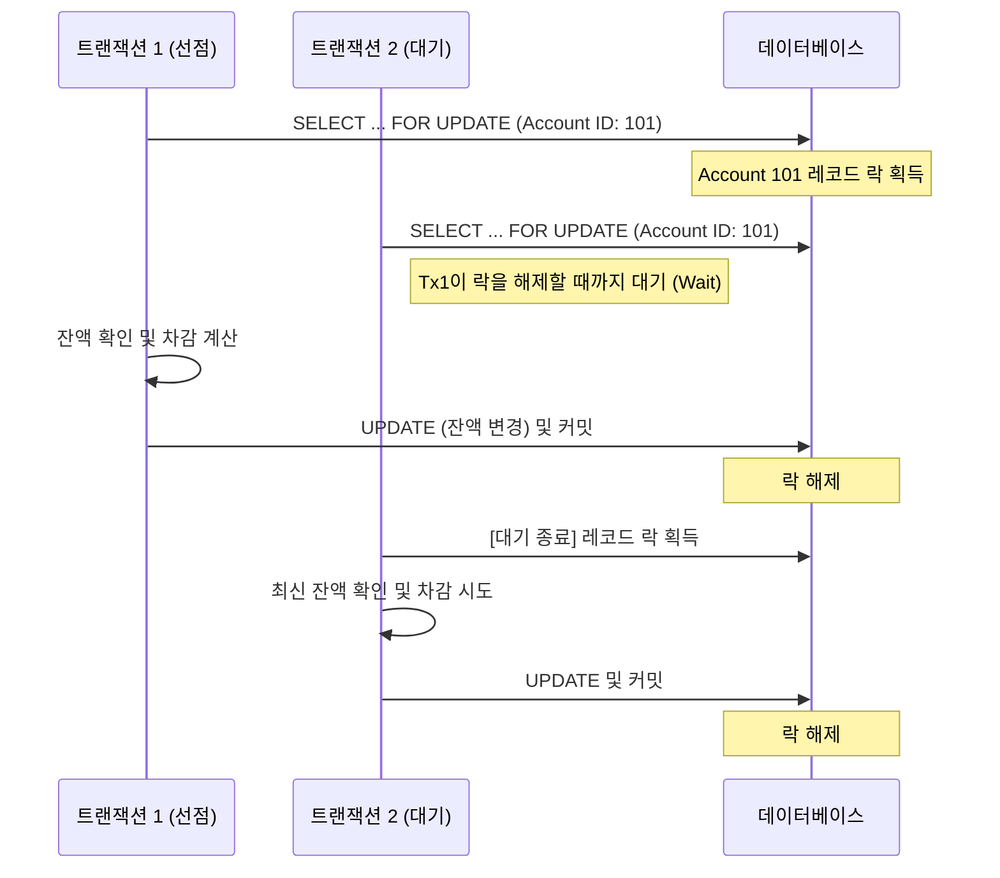

# [에잇퍼센트/페이레터] 비관적 락(Pessimistic Lock)을 이용한 결제 동시성 제어

### 🏢 소속 / 기간
- **회사**: ㈜에잇퍼센트, 페이레터㈜
- **관련 도메인**: 코어뱅킹(계좌 잔액), 빌링(캐시 잔액)

### ❓ 문제 상황 (Challenge)
- **동시성 이슈**: 결제/출금 시스템에서 동일한 계정(Account)에 대해 거의 동시에 여러 건의 차감 요청이 들어올 경우, 데이터 정합성이 깨질 위험이 있음.
- **Race Condition**: 두 트랜잭션이 동시에 잔액을 읽고 수정할 때, 나중에 커밋된 데이터가 먼저 커밋된 데이터를 덮어쓰는 **Lost Update** 현상이 발생하여 마이너스 잔액이 되거나 데이터가 누락될 수 있음.

### 🛠 해결 방안 (Action)
- **비관적 락(Pessimistic Lock) 도입**: DB 수준에서 `SELECT ... FOR UPDATE`를 사용하여 특정 레코드에 대한 점유권을 명시적으로 획득하는 비관적 락을 적용.
- **비관적 락 채택 이유**:
    - **락 충돌 저빈도**: 시스템 특성상 특정 계정에 대해 아주 빈번하게 동시 요청이 발생할 확률이 낮음(Low Contention).
    - **짧은 대기 시간**: 락이 걸리더라도 각 트랜잭션의 처리 시간이 짧아 후속 트랜잭션의 대기 시간이 시스템 성능에 미치는 영향이 미미할 것으로 판단.
    - **정합성 우선**: 금융 서비스의 특성상 동시성 제어 실패로 인한 데이터 꼬임 비용이 매우 크므로, 어플리케이션 계층의 복잡한 재시도 로직보다 DB 수준의 확실한 데이터 보호를 선택.
- **Spring Data JPA @Lock 활용**: Repository 계층에서 `LockModeType.PESSIMISTIC_WRITE`를 설정하여 데이터 조회 시점에 배타적 락을 획득하도록 구현.

#### 📊 비관적 락 동작 흐름


### 💻 코드 예시 (Java / Spring Data JPA)

#### 1. Entity
```java
@Entity
@Table(name = "account_balance")
public class AccountBalance {
    @Id
    private Long accountId;

    private BigDecimal balance;

    public void withdraw(BigDecimal amount) {
        if (balance.compareTo(amount) < 0) {
            throw new IllegalStateException("INSUFFICIENT_FUNDS");
        }
        this.balance = this.balance.subtract(amount);
    }
}
```

#### 2. Repository: 비관적 락 설정
```java
public interface AccountBalanceRepository extends JpaRepository<AccountBalance, Long> {
    @Lock(LockModeType.PESSIMISTIC_WRITE)
    @Query("select a from AccountBalance a where a.accountId = :accountId")
    Optional<AccountBalance> findByIdWithLock(@Param("accountId") Long accountId);
}
```

#### 3. Service: 트랜잭션 내 락 획득 및 처리
```java
@Service
public class PaymentService {
    private final AccountBalanceRepository repo;

    @Transactional
    public void pay(Long accountId, BigDecimal amount) {
        // 1. SELECT ... FOR UPDATE 쿼리 실행 (DB 수준 락 획득)
        AccountBalance ab = repo.findByIdWithLock(accountId)
                .orElseThrow(() -> new IllegalArgumentException("ACCOUNT_NOT_FOUND"));

        // 2. 비즈니스 로직 수행 (잔액 차감)
        ab.withdraw(amount);

        // 3. 메서드 종료 시 트랜잭션 커밋과 함께 DB 락 해제
    }
}
```

### 💡 실무 팁
- **타임아웃 설정**: 비관적 락 사용 시 무한정 대기를 방지하기 위해 `javax.persistence.lock.timeout` 힌트를 활용하여 적절한 타임아웃을 설정해야 함.
- **데드락 주의**: 여러 테이블을 수정할 경우 락을 획득하는 순서를 일관되게 유지하여 데드락(Deadlock) 발생 가능성을 차단해야 함.

### ✨ 성과 및 결과 (Result)
- **완벽한 정합성 보장**: DB 수준의 강한 락을 통해 동시 요청 시에도 데이터 불일치 문제를 근본적으로 해결.
- **구현 단순화**: 별도의 재시도 로직이나 버전 관리 없이 JPA 표준 어노테이션만으로 복잡한 동시성 제어를 안전하게 구현.
- **안정적인 처리량**: 실제 운영 환경에서 락 대기로 인한 병목 현상 없이 안정적으로 결제 요청을 처리함.
