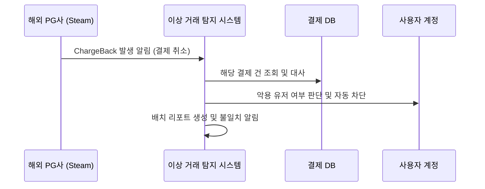

# [페이레터] 해외 결제 취소(ChargeBack) 악용 유저 차단 및 대사 배치 시스템

### 🏢 소속 / 기간
- **회사**: 페이레터㈜ (플랫폼기술팀)
- **기간**: 2018.09 ~ 2022.06

### ❓ 문제 상황 (Challenge)
- **Steam PG 서비스 오픈 및 매출 급증**: Steam 결제 수단 오픈 이후 글로벌 결제량이 폭증하며 매출이 전월 대비 수배 이상 급격히 상승함.
- **대량의 ChargeBack 발생**: 서비스 안정화 단계에 접어든 며칠 뒤, 해외 PG사로부터 대규모의 ChargeBack(해외 결제 취소) 통지서가 접수됨.
- **부정 사용 유저 기승**: ChargeBack의 특성(결제 후 수일 뒤 취소 가능)을 악용한 유저들이 유료 재화를 부정 획득하고 잠적하는 사례 빈번.
- **수동 검증의 한계**: 수만 건의 결제 건을 일일이 대조하여 차단하기에는 리소스가 부족하고 탐지 속도가 느려 추가 피해 방지가 어려움.

### 💡 지식 공유: ChargeBack(차지백)이란?
해외 결제 시스템에서 카드 소유자를 보호하기 위해 마련된 강력한 소비자 권리 제도입니다.

- **개념**: 카드 소유자가 본인이 하지 않은 결제이거나, 약속된 서비스/물건을 받지 못했을 때 카드사에 결제 대금 환불을 요구하는 절차입니다.
- **특성 (왜 악용되는가?)**:
    1. **후행적 발생**: 결제 시점에 바로 알 수 있는 것이 아니라, 짧게는 며칠에서 길게는 수개월(최대 180일) 뒤에 발생합니다.
    2. **소비자 중심의 즉시 취소 구조**: 해외 결제 시스템은 소비자 보호를 최우선으로 합니다. **카드 소유자가 카드사에 차지백을 신청하면, 가맹점(회사)의 확인이나 동의 절차 없이 일단 결제 대금이 소비자에게 환불(취소)됩니다.** 가맹점은 사후에 이의 제기(Representment)를 할 수 있지만, 이미 대금은 빠져나간 상태입니다.
    3. **비대면 거래의 취약성**: 카드 번호와 CVC만 있으면 결제가 가능한 해외 PG 특성상, 도용된 카드로 결제 후 실제 소유자가 차지백을 신청하면 가맹점은 속수무책으로 당하게 됩니다.
    4. **우호적 사기(Friendly Fraud)**: 실제 유저가 재화를 다 사용한 뒤, 고의로 카드사에 "모르는 결제다"라고 신고하여 대금을 환급받는 수법입니다. 가맹점이 정상 서비스 제공을 증명하기가 까다로운 점을 악용합니다.
- **영향**: 차지백이 발생하면 매출 취소는 물론, PG사로부터 **차지백 수수료(Penalty)**를 추가로 부과받으며, 발생률이 높을 경우 PG 서비스 자체가 중단될 수 있습니다.

### 🛠 해결 방안 (Action)
- **이상 거래 탐지 시스템 구축**: ChargeBack 발생 패턴을 분석하여 악용 유저를 자동으로 차단하는 시스템 구현.
- **대사 배치 프로그램 개발**: GPOQ, POQ 데이터를 연동하여 결제 불일치를 자동으로 검증하는 배치 시스템 구축.

#### 📊 대사 배치 및 차단 흐름도

### ✨ 성과 및 결과 (Result)
- **Steam 서비스 안정적 안착**: Steam PG 오픈 초기 폭발적인 결제량에도 불구하고, 차지백 리스크를 시스템적으로 제어하여 매출 유지 및 안정적인 정산 기반 마련.
- **부정 결제 피해 최소화**: 악용 유저 자동 차단을 통해 자산 보호 및 PG사 부과 패널티 감소.
- **운영 리소스 절감**: 대사 배치 자동화로 수동 검증 업무 90% 이상 제거 및 휴먼 에러 방지.
- **데이터 정합성 확보**: 글로벌 플랫폼과의 복잡한 대사 프로세스를 시스템화하여 신뢰도 높은 결제 인프라 구축.
