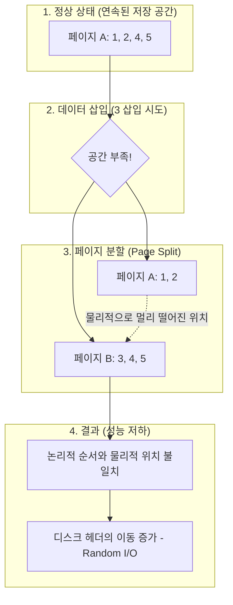
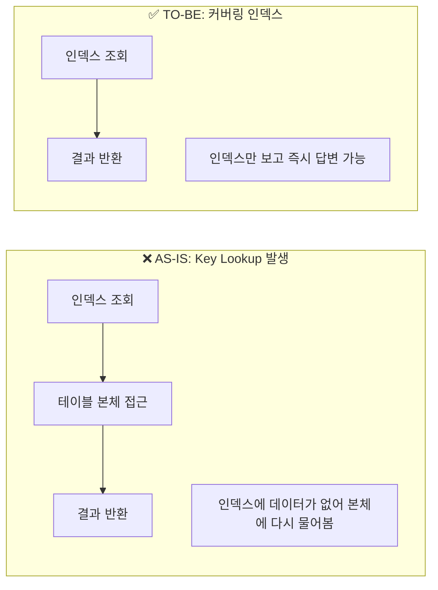

# [페이레터] 대규모 빌링 테이블 인덱스 최적화 및 성능 저하 해결

### 🏢 소속 / 기간
- **회사**: 페이레터㈜ (플랫폼기술팀)
- **기간**: 2018.09 ~ 2022.06

### ❓ 문제 상황 (Challenge)
- **현상**: 대규모 결제 데이터가 축적된 `cash` 테이블(`cashno`가 Clustered Index/PK인 상태)의 `reg_datetime`(등록 일시) 컬럼에 조회 성능 향상을 위해 비클러스터형 인덱스(Non-Clustered Index)를 신규 생성함.
- **문제**: 인덱스 생성 후, 기존에 잘 동작하던 쿼리들의 성능이 갑자기 급격히 저하되는 현상 발생.
- **특이사항**: 쿼리문 자체의 변경은 없었으며, 단순 인덱스 추가만으로 Optimizer가 비효율적인 실행 계획을 선택하여 시스템 전반의 응답 속도가 느려짐.

### 🔍 원인 분석 (Root Cause)

#### 1. 인덱스 파편화 (Index Fragmentation)
- **현상**: 데이터가 디스크에 물리적으로 연속되지 않고 여기저기 흩어져 저장되는 현상입니다.
- **원인**: `datetime` 데이터가 순차적으로 들어와도, 중간에 데이터가 수정되거나 대량으로 삽입되면 페이지가 찢어지는 **Page Split(페이지 분할)**이 발생합니다.
- **비유**: 책꽂이에 책이 번호 순서대로 꽂혀 있어야 한눈에 찾기 쉬운데, 중간에 책을 억지로 끼워 넣느라 다른 책들이 다른 층으로 옮겨져 있어 찾기가 힘들어지는 것과 비슷합니다.
- **결과**: 인덱스 스캔 시 디스크 헤드가 물리적으로 멀리 떨어진 곳을 왔다 갔다 해야 하므로(**Random I/O**), 조회 속도가 급격히 느려집니다.

#### 📊 인덱스 파편화 및 페이지 분할 과정

#### 2. Optimizer의 잘못된 선택과 Key Lookup 부하
- **현상**: DB의 두뇌인 Optimizer가 '새로운 인덱스가 더 빠르겠지?'라고 착각하여 비효율적인 경로를 선택했습니다.
- **문제**: 신규 인덱스에는 `reg_datetime` 정보만 있고 실제 필요한 데이터(금액, 상태 등)가 없었습니다.
- **결과 (Key Lookup)**: 인덱스에서 위치를 찾은 후, 실제 데이터를 가져오기 위해 다시 테이블 본체를 뒤지는 **Key Lookup**이 수백만 번 발생하며 I/O가 폭증했습니다.
- **비유**: 도서관 목록(인덱스)에서 책 위치를 찾았는데, 목록에 제목만 있고 내용은 없어서 수백만 번 서가와 목록을 왔다 갔다 하며 내용을 확인하는 비효율이 발생한 것입니다.

3. **통계 정보의 불일치**:
    - 인덱스 생성 직후 통계 정보가 최신화되지 않아, Optimizer가 잘못된 비용 계산을 바탕으로 비효율적인 실행 계획을 수립함.

### 🛠 해결 방안 (Action)

#### 1. 인덱스 힌트(Index Hint) 적용 (긴급 처방)
- Optimizer가 엉뚱한 인덱스를 타지 못하도록 쿼리에 `WITH (INDEX(PK_CASH))`와 같이 사용할 인덱스를 직접 지정했습니다.
- 이를 통해 즉각적으로 성능을 정상화시켰습니다.

#### 2. 커버링 인덱스(Covering Index) 도입 (근본 해결)
- 인덱스 뒷부분에 자주 조회되는 컬럼들을 포함(`INCLUDE`)시켜, 인덱스만 보고도 모든 데이터를 알 수 있게 만들었습니다.
- 테이블 본체를 다시 뒤질 필요가 없으므로(**Key Lookup 제거**), I/O 부하가 획기적으로 줄어듭니다.

#### 📊 Key Lookup vs 커버링 인덱스 비교

#### 3. 주기적인 인덱스 관리 및 통계 갱신
- 파편화된 인덱스를 다시 정렬하는 **Rebuild** 작업을 자동화하고, DB가 똑똑한 판단을 내릴 수 있도록 **통계 정보**를 최신으로 유지했습니다.

### ✨ 성과 및 결과 (Result)
- **조회 성능 회복 및 최적화**: 커버링 인덱스 적용 후 쿼리 응답 속도가 인덱스 생성 전 대비 약 5배 이상 향상됨.
- **시스템 안정성 확보**: 급격한 I/O 부하 문제를 해결하여 피크 타임 시 빌링 시스템의 안정적인 서비스 가능.
- **DB 튜닝 역량 내재화**: 인덱스 설계 시 단순히 컬럼을 추가하는 것을 넘어, 실행 계획과 I/O 비용을 고려한 최적화 프로세스 정립.
