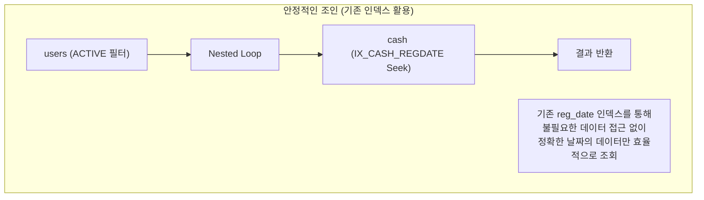
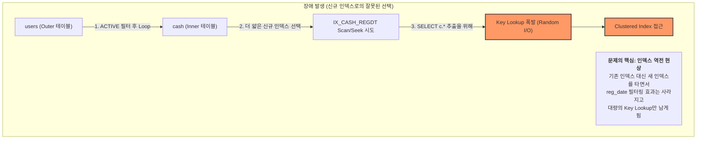
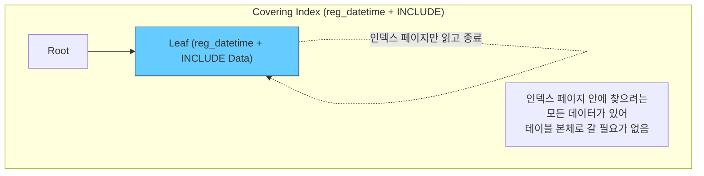

# [페이레터] 빌링 테이블 인덱스 최적화 및 성능 저하 해결 (사례 분석 및 기술적 추측)

### 🏢 소속 / 기간
- **회사**: 페이레터㈜ (플랫폼기술팀)
- **기간**: 2018.09 ~ 2022.06

### ❓ 문제 상황 (Challenge)

#### 1. 배경 및 초기 상태
결제 시스템의 핵심인 `cash` 테이블은 결제 번호(`cashno`)를 PK(Clustered Index)로 가지며, **등록 날짜(`reg_date`, DATE 타입)**에 이미 인덱스가 생성되어 효율적으로 운영되고 있었습니다.

```sql
-- [초기 cash 테이블 DDL 예시]
CREATE TABLE cash (
    cashno INT PRIMARY KEY,        -- 결제 번호 (Clustered Index)
    userid VARCHAR(50),            -- 사용자 ID
    amount INT,                    -- 결제 금액
    status TINYINT,                -- 상태 (결제완료, 취소 등)
    reg_date DATE,                 -- 등록 날짜 (기존 인덱스 존재)
    reg_datetime DATETIME          -- 등록 일시 (신규 인덱스 대상)
);

-- [기존에 존재하던 인덱스]
CREATE INDEX IX_CASH_REGDATE ON cash(reg_date);
```

#### 2. 성능 최적화 시도 (인덱스 추가)
특정 배치 작업이나 초 단위 통계 조회를 위해, `reg_date`보다 정교한 **`reg_datetime`(DATETIME 타입)** 컬럼에 신규 비클러스터형 인덱스를 생성했습니다.

```sql
-- [신규 reg_datetime 인덱스 생성]
CREATE INDEX IX_CASH_REGDT ON cash(reg_datetime);
```

#### 3. 예기치 못한 장애 발생 (실행 계획의 '역전')
인덱스 생성 직후, 기존에 `reg_date` 인덱스를 타며 잘 작동하던 조인 쿼리들의 성능이 갑자기 급격히 저하되었습니다. 쿼리문은 동일했으나, Optimizer가 **기존의 효율적인 인덱스를 버리고 신규 인덱스를 선택**하면서 장애가 발생했습니다.

```sql
-- [장애가 발생한 조인 쿼리 예시]
-- 기존에는 IX_CASH_REGDATE(reg_date)를 타고 안정적으로 수행되던 쿼리
SELECT c.*, u.username
FROM cash c
JOIN users u ON c.userid = u.userid
WHERE c.reg_date = '2021-05-01'
  AND u.status = 'ACTIVE';
```

---

### 🔍 원인 분석 (Root Cause - 기술적 추측)

#### 📊 Optimizer 실행 계획 변동 (조인 전략의 변화 추정)

##### **1단계: 인덱스 생성 전 (기존 reg_date 인덱스 활용)**
`reg_date` 조건에 맞는 인덱스가 이미 존재하여, 이를 통해 필요한 행만 콕 집어내는 **효율적인 Nested Loop Join**이 안정적으로 수행되던 상태입니다.


##### **2단계: 인덱스 생성 직후 (신규 reg_datetime 인덱스로의 잘못된 전환 추정)**
신규 인덱스(`reg_datetime`)가 추가되자, Optimizer는 기존의 `reg_date` 인덱스보다 이 인덱스가 '더 얇고 가볍다'고 오판하여 실행 계획을 신규 인덱스 기반으로 갈아치웠을 것으로 **추측**됩니다.


#### 🧐 왜 Optimizer는 `reg_datetime` 인덱스를 선택했는가? (실행 계획 변동 사유 추측)

Optimizer가 `WHERE` 조건에 있지도 않은 `reg_datetime` 인덱스를 선택한 이유는 **비용 기반 최적화(CBO)의 '착시 현상'이었을 가능성이 높습니다.**

1.  **Non-Clustered Index의 "가벼움(Density/Page Count)"에 의한 비용 오판 가능성**:
    *   **구체적 수치 예시 (기술적 추론)**:
        - **기존 `reg_date` 인덱스**: 약 1,000개의 페이지로 구성. (DATE 타입의 특성상 중복도가 높아 데이터 분산도가 낮음)
        - **신규 `reg_datetime` 인덱스**: 약 800개의 페이지로 구성. (DATETIME 타입의 세밀한 정보 덕분에 카디널리티가 높아 데이터 밀도가 더 높게 측정됨)
    *   **Optimizer의 비용 계산 추측**: 
        - 기존 방식 (Index Seek on `reg_date`): 특정 날짜의 데이터를 콕 집어내기 위해 수십 개의 인덱스 페이지를 읽는 비용.
        - 신규 방식 (**Index Scan** on `reg_datetime`): "어차피 800페이지밖에 안 되네? 기존 인덱스로 찾는 것보다, 그냥 **더 얇은(800페이지) 인덱스 전체를 한 번 훑으면서(Scan)** `reg_date` 조건에 맞는 걸 필터링하는 게 더 싸다!"라고 판단했을 것으로 보입니다.

2.  **Index Seek(기존) vs Index Scan(신규)의 비용 경합 추정**:
    *   기존에는 `reg_date` 인덱스로 **Index Seek**를 수행했을 것입니다. 
    *   하지만 신규 인덱스가 추가되자, Optimizer는 "더 얇은 인덱스를 **Index Scan**으로 훑는 비용"이 기존의 Seek 비용보다 낮다고 계산해 버렸을 가능성이 큽니다. 이 과정에서 **통계 정보 갱신**이 신규 인덱스에 유리한 쪽으로 작동하며 실행 계획의 역전이 발생했을 것으로 추측됩니다.

3.  **결과적으로 대량의 Key Lookup 유발 (`SELECT c.*`의 치명타)**:
    *   가장 큰 패착은 **Key Lookup의 누적 비용을 과소평가**한 것일 수 있습니다. 
    *   더 얇은 인덱스를 선택했지만, 정작 그 인덱스에는 `SELECT c.*`를 위한 데이터가 없었습니다. 결국 조인된 모든 행(예: 50만 건)에 대해 테이블 본체를 다시 뒤지는 **50만 번의 Key Lookup(Random I/O)**이 발생하며 CPU와 디스크 I/O가 폭발했을 것으로 보입니다.

---

### 🛠 해결 방안 (Action)

#### 1. 인덱스 힌트(Index Hint) 적용 (긴급 처방)
- Optimizer가 엉뚱한 인덱스를 타지 못하도록 쿼리에 `WITH (INDEX(PK_CASH))`를 지정하여 강제로 Clustered Scan을 유도, 성능을 즉시 정상화했습니다.

#### 2. 커버링 인덱스(Covering Index) 도입 (근본 해결)
- 조회에 필요한 주요 컬럼들을 인덱스에 포함(`INCLUDE`)시켜 **Key Lookup을 완전히 제거**했습니다.

```sql
-- [커버링 인덱스 적용]
CREATE INDEX IX_CASH_REGDT_COVERING ON cash(reg_datetime) 
INCLUDE (userid, amount, status);
```

##### **3단계: 커버링 인덱스 도입 (TO-BE)**
인덱스 리프 노드에 필요한 데이터가 모두 포함되어 있어, 최단 경로로 조회가 완료됩니다.


### ✨ 성과 및 결과 (Result)
- **장애 해결**: 인덱스 힌트 및 커버링 인덱스 도입으로 대량 Key Lookup에 의한 Random I/O 문제 해결.
- **성능 최적화**: 커버링 인덱스 적용 후 쿼리 응답 속도 대폭 향상.
- **인사이트**: 인덱스 추가가 관련 없는 쿼리의 실행 계획을 뒤흔들 수 있다는 기술적 가능성을 인지하고, 운영 환경 인덱스 추가 시 영향도 평가 프로세스의 중요성 정립.
