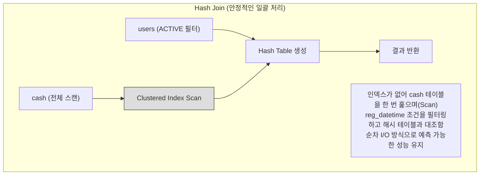
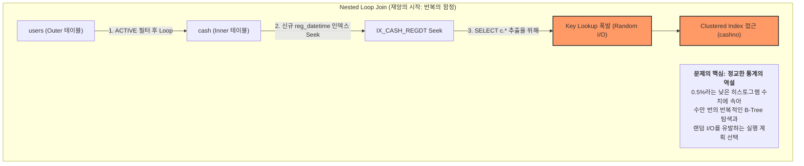
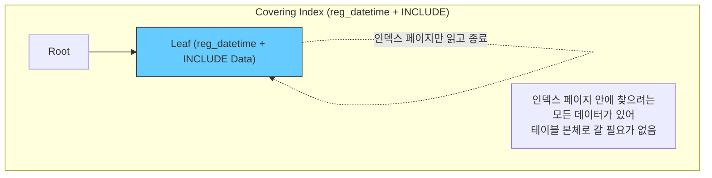

# [페이레터] 빌링 테이블 인덱스 최적화 및 성능 저하 해결 (장애 분석 보고서)

### 🏢 소속 / 기간
- **회사**: 페이레터㈜ (플랫폼기술팀)
- **기간**: 2018.09 ~ 2022.06

### ❓ 문제 상황 (Challenge)

#### 1. 배경 및 초기 상태
결제 시스템의 핵심인 `cash` 테이블은 결제 번호(`cashno`)를 PK(Clustered Index)로 가지며, 수백만 건의 데이터가 축적된 상태였습니다.

```sql
-- [초기 cash 테이블 DDL 예시]
CREATE TABLE cash (
    cashno INT PRIMARY KEY,        -- 결제 번호 (Clustered Index)
    userid VARCHAR(50),            -- 사용자 ID
    amount INT,                    -- 결제 금액
    status TINYINT,                -- 상태 (결제완료, 취소 등)
    reg_datetime DATETIME          -- 등록 일시
);
```

#### 2. 성능 최적화 시도 (인덱스 추가)
특정 배치 작업이나 통계 조회를 위해 `reg_datetime` 컬럼의 성능을 향상시키고자 **비클러스터형 인덱스(Non-Clustered Index)**를 신규 생성했습니다.

```sql
-- [조회 성능 개선을 위해 신규 인덱스 생성]
CREATE INDEX IX_CASH_REGDT ON cash(reg_datetime);
```

#### 3. 예기치 못한 장애 발생 (조인 쿼리 성능 폭락)
인덱스 생성 직후, 기존에 잘 동작하던 조인 쿼리들의 성능이 갑자기 급격히 저하되었습니다. 쿼리문은 동일했으나, DB의 **Optimizer(CBO)**가 실행 계획을 변경하면서 시스템 전반의 응답 속도가 느려지는 장애가 발생했습니다.

```sql
-- [장애가 발생한 조인 쿼리 예시]
-- reg_datetime 조건이 있음에도 불구하고 인덱스 생성 전후로 성능이 극명하게 갈림
SELECT c.*, u.username
FROM cash c
JOIN users u ON c.userid = u.userid
WHERE c.reg_datetime BETWEEN '2021-05-01' AND '2021-05-31'
  AND u.status = 'ACTIVE';
```

---

### 🔍 원인 분석 (Root Cause)

#### 📊 Optimizer 실행 계획 변동 (조인 전략의 변화)

##### **1단계: 인덱스 생성 전 (Hash Join + Clustered Scan)**
`reg_datetime` 조건이 있어도 활용 가능한 인덱스가 없었기 때문에, 대량의 데이터를 효율적으로 처리하기 위해 **Hash Join**을 선택하여 안정적인 성능을 유지하던 상태입니다.


##### **2단계: 인덱스 생성 직후 (Nested Loop Join + Key Lookup 폭발)**
신규 인덱스(`reg_datetime`)가 추가되자, Optimizer는 이 인덱스를 통해 '데이터 범위를 매우 좁게 필터링할 수 있다'고 **오판**합니다. 이에 따라 대량 처리용 Hash Join을 버리고 건별 처리용 **Nested Loop Join**으로 전략을 변경하며 재앙이 시작됩니다.


#### 🧐 왜 Optimizer는 `reg_datetime` 인덱스를 선택했는가? (실행 계획 변동 사유)

1.  **신규 인덱스로 인해 정교해진 히스토그램(Histogram)**:
    *   인덱스 생성 전에는 `reg_datetime`의 상세 분포를 몰라 안전하게 전체 스캔을 수행했습니다.
    *   인덱스 생성 직후 **매우 정교한 히스토그램**이 생성되었고, Optimizer는 "조회 기간 데이터가 전체의 0.5%뿐이네? 인덱스를 타면 매우 빠르겠군!"이라고 **오판**했습니다.

2.  **Non-Clustered Index는 "더 가볍다"는 비용 착시**:
    *   `IX_CASH_REGDT` 인덱스 페이지는 데이터 페이지보다 훨씬 '얇고 가볍기' 때문에, Optimizer는 이를 읽는 비용이 매우 저렴하다고 계산했습니다.
    *   하지만 그 뒤에 따라오는 **수만 번의 Key Lookup(Random I/O) 누적 비용**이 전체 테이블을 순차적으로 훑는 비용보다 훨씬 비싸지는 지점(Tipping Point)을 간과했습니다.

3.  **조인 방식의 변화 (Hash → Nested Loop)**:
    *   통계 정보가 갱신되면서, 특정 데이터 범위를 인덱스로 콕 집어낼 수 있다고 판단한 Optimizer가 대량 처리에 유리한 **Hash Join** 대신 건건이 탐색하는 **Nested Loop Join**을 선택하게 되었습니다.

3.  **`SELECT c.*`가 결정적 폭탄**:
    *   `IX_CASH_REGDT`에는 `c.*`에 해당하는 나머지 컬럼들이 없습니다.
    *   따라서 조인된 모든 행(예: 50만 건)에 대해 테이블 본체를 다시 뒤지는 **50만 번의 Key Lookup(Random I/O)**이 발생하며 CPU와 디스크 I/O가 폭발했습니다.

---

### 🛠 해결 방안 (Action)

#### 1. 인덱스 힌트(Index Hint) 적용 (긴급 처방)
- Optimizer가 엉뚱한 인덱스를 타지 못하도록 쿼리에 `WITH (INDEX(PK_CASH))`를 지정하여 강제로 Clustered Scan을 유도, 성능을 즉시 정상화했습니다.

#### 2. 커버링 인덱스(Covering Index) 도입 (근본 해결)
- 조회에 필요한 주요 컬럼들을 인덱스에 포함(`INCLUDE`)시켜 **Key Lookup을 완전히 제거**했습니다.

```sql
-- [커버링 인덱스 적용]
CREATE INDEX IX_CASH_REGDT_COVERING ON cash(reg_datetime) 
INCLUDE (userid, amount, status);
```

##### **3단계: 커버링 인덱스 도입 (TO-BE)**
인덱스 리프 노드에 필요한 데이터가 모두 포함되어 있어, 최단 경로로 조회가 완료됩니다.


### ✨ 성과 및 결과 (Result)
- **장애 해결**: 대량 Key Lookup에 의한 Random I/O 폭발을 해결하여 시스템 안정성 확보.
- **성능 최적화**: 커버링 인덱스 적용 후 쿼리 응답 속도가 대폭 향상됨.
- **DB 튜닝 인사이트**: 인덱스 추가가 관련 없는 쿼리의 실행 계획을 뒤흔들 수 있다는 점을 인지하고, 운영 환경 인덱스 추가 시 영향도 평가 프로세스 정립.
