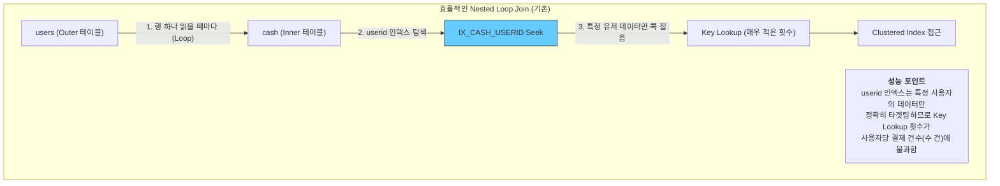
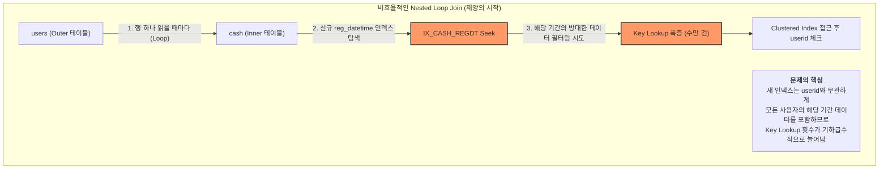

# [페이레터] 빌링 테이블 인덱스 최적화 및 성능 저하 해결

### 🏢 소속 / 기간
- **회사**: 페이레터㈜ (플랫폼기술팀)
- **기간**: 2018.09 ~ 2022.06

### ❓ 문제 상황 (Challenge)

#### 1. 배경 및 초기 상태
결제 시스템의 핵심인 `cash` 테이블은 결제 번호(`cashno`)를 PK로 가지며, 수백만 건의 데이터가 축적된 상태였습니다.

```sql
-- [초기 cash 테이블 DDL 예시]
CREATE TABLE cash (
    cashno INT PRIMARY KEY,        -- 결제 번호 (Clustered Index)
    userid VARCHAR(50),            -- 사용자 ID
    amount INT,                    -- 결제 금액
    status TINYINT,                -- 상태 (결제완료, 취소 등)
    reg_datetime DATETIME          -- 등록 일시
);
```

#### 2. 성능 최적화 시도 (인덱스 추가)
특정 배치 작업이나 통계 조회를 위해 `reg_datetime` 컬럼의 성능을 향상시키고자 **비클러스터형 인덱스(Non-Clustered Index)**를 신규 생성했습니다.

```sql
-- [문제가 된 조회 쿼리 예시 (JOIN 포함, reg_datetime 조건 없음)]
-- reg_datetime 조건이 전혀 없는 쿼리였음에도 성능이 급격히 저하되었습니다.
SELECT c.*, u.username
FROM cash c
JOIN users u ON c.userid = u.userid
WHERE u.status = 'ACTIVE'; -- reg_datetime 조건은 어디에도 없음

-- [조회 성능 개선을 위해 신규 인덱스 생성]
CREATE INDEX IX_CASH_REGDT ON cash(reg_datetime);
```

#### 3. 예기치 못한 성능 저하 발생 (조인 쿼리 성능 폭락)
인덱스 생성 직후, 기존에 잘 동작하던 **조인(JOIN) 기반 쿼리**들의 성능이 갑자기 급격히 저하되었습니다. `WHERE` 조건에 신규 인덱스 컬럼이 없음에도 불구하고, DB의 **Optimizer(CBO)**가 실행 계획의 **조인 방식(Join Strategy)**을 변경하면서 시스템 전반의 응답 속도가 느려지는 이슈가 발생했습니다.

### 🔍 원인 분석 (Root Cause)

#### 📊 Optimizer 실행 계획 변동 (조인 전략의 변화)

##### **1단계: 인덱스 생성 전 (userid 인덱스 기반의 효율적인 조인)**
조인 조건인 `userid` 컬럼에 인덱스가 있어, 특정 사용자의 결제 내역만 콕 집어내는 **Nested Loop Join**이 이미 효율적으로 작동하던 상태입니다.


##### **2단계: 인덱스 생성 직후 (reg_datetime 인덱스로의 잘못된 전환)**
신규 인덱스(`reg_datetime`)가 추가되자, Optimizer는 기존의 `userid` 인덱스보다 `reg_datetime` 인덱스가 '범위를 더 좁게 필터링할 수 있는 도구'라고 **오판**합니다. 이로 인해 기존의 효율적인 조인 경로를 버리고 **비효율적인 새로운 경로**를 선택하면서 재앙이 시작됩니다.



**왜 성능이 폭락했을까요? (실제 테이블 데이터 기반 분석)**
- **1단계 (기존 userid 인덱스 활용)**: 
    - `users` 테이블에서 `status = 'ACTIVE'`인 사용자를 한 명 읽습니다.
    - `cash` 테이블의 `userid` 인덱스를 통해 해당 사용자의 결제 내역(보통 수 건 내외)만 **정확히 콕 집어서** Key Lookup을 수행합니다. (매우 효율적!)
- **2단계 (신규 reg_datetime 인덱스로 갈아탐)**: 
    - Optimizer가 "userid 인덱스보다 날짜 인덱스가 더 효율적이겠는데?"라고 오판하여 실행 계획을 바꿉니다.
    - 이제 사용자 한 명을 읽을 때마다, `cash` 테이블의 **날짜 인덱스**를 통해 해당 기간의 **모든 사용자 데이터**를 훑으면서 그중에 이 사용자가 맞는지 일일이 대조하게 됩니다.
    - 이 과정에서 조인 대상인 사용자가 늘어날수록 **불필요한 Key Lookup이 중복해서 수만 번 발생**하게 되어 CPU와 디스크 I/O가 마비되었습니다.

#### 1. Optimizer의 실행 계획 변동 (Execution Plan Change)
- **핵심 원인**: "인덱스를 추가했을 뿐인데 왜 느려졌는가?"에 대한 근본적인 이유입니다.
- **현상**: 새로운 인덱스가 생성되면 DB의 Optimizer는 이를 활용할 수 있는 새로운 경로를 계산합니다. 이때 **통계 정보(Statistics)**가 최신화되지 않았거나, Optimizer가 인덱스 스캔 후 발생하는 **Key Lookup 비용**을 과소평가하여 잘못된 실행 계획을 수립할 수 있습니다.
- **Key Lookup의 함정 (정렬 순서가 유사하더라도 발생하는 문제)**: 
    - 만약 `cashno`(PK/Clustered Index)가 `날짜 + 시퀀스` 형태여서 `reg_datetime`과 물리적 정렬 순서가 유사하더라도, 여전히 **Key Lookup의 오버헤드**는 치명적입니다.
    - **이중 B-Tree 탐색 (Nested Loop Overhead)**: Clustered Index Scan은 리프 페이지들의 포인터만 따라가며 쭉 읽으면 되지만, Key Lookup은 인덱스에서 찾은 **매 행(Row)마다** Clustered Index의 루트(Root)부터 리프(Leaf)까지 다시 타고 내려가야 하는 **반복적인 탐색 비용**이 발생합니다.
    - **페이지 접근 횟수의 폭증**: 1만 건의 데이터를 조회할 때, Scan은 필요한 수백 개의 페이지를 한 번씩만 읽으면 되지만, Key Lookup은 동일한 데이터 페이지를 1만 번 다시 열어보는 비효율이 발생할 수 있습니다. (CPU 및 메모리 부하 급증)
    - **임계치(Tipping Point)**: 보통 조회하려는 데이터가 전체의 3~5%를 넘어가면 Optimizer는 "아무리 순서가 비슷해도 만 번씩 루트부터 뒤지는 것보다 그냥 처음부터 끝까지 한 번 훑는 게 싸다!"라고 판단해야 합니다. 하지만 이번 사례에서는 Optimizer가 이 비용을 오판하여 비효율적인 경로를 선택한 것이 성능 저하의 핵심이었습니다.

#### 2. 통계 정보의 결정적 역할 (Role of Statistics)
- **핵심 지표**: Optimizer가 실행 계획을 세울 때 참조하는 데이터의 '지도'와 같습니다.
    - **행 수(Row Count)**: 테이블이나 인덱스에 포함된 전체 레코드 수.
    - **밀도(Density)**: 컬럼 값의 중복도. 밀도가 낮을수록(유니크할수록) 인덱스 효율이 높다고 판단합니다.
    - **히스토그램(Histogram)**: 특정 컬럼 값의 분포도. (예: 2021년 데이터는 전체의 10%, 2022년 데이터는 80% 등)
- **신규 인덱스 생성 후의 통계 상태 (추측)**:
    - 인덱스를 처음 생성하면 DB 엔진은 전체 데이터를 훑으며 **최신 통계(Full Scan Statistics)**를 생성합니다.
- **문제 발생 시나리오 (데이터가 이미 모두 들어있던 상태)**:
    - `reg_datetime` 컬럼은 모든 행에 데이터가 이미 있었으므로, 인덱스 생성 전에도 Optimizer는 대략적인 행 수와 밀도를 알고 있었을 것입니다.
    - **인덱스 생성 전**: `reg_datetime` 전용 통계가 없거나 부족하여, 특정 날짜 조회를 위해 전체 테이블을 훑는 **Clustered Index Scan**을 선택했습니다. (비효율적이지만 예측 가능한 성능)
    - **인덱스 생성 후**: `reg_datetime` 컬럼에 대한 **매우 정교한 히스토그램**이 즉시 생성되었습니다. Optimizer는 이를 보고 "오! 2021년 5월 데이터는 전체의 0.5%뿐이네? 인덱스를 타면 순식간에 찾겠는걸?"이라며 **Index Seek + Key Lookup** 경로를 선택합니다.
    - **오판의 핵심**: Optimizer는 0.5%라는 '낮은 비율'만 보고, 그 0.5%가 실제로는 **수만 건의 Random I/O(Key Lookup)**를 유발한다는 사실을 과소평가했습니다. 수만 번의 디스크 헤더 이동 비용이 차라리 전체 페이지를 순차적으로 읽는(Sequential Scan) 비용보다 커진 것이 성능 저하의 결정적 원인입니다.

#### 3. 통계 정보 최신화의 중요성
- 인덱스 생성 후 Optimizer가 해당 인덱스의 데이터 분포를 정확히 참조할 수 있도록 통계 정보를 관리해야 함.

### 🛠 해결 방안 (Action)

#### 1. 인덱스 힌트(Index Hint) 적용 (긴급 처방)
- Optimizer가 엉뚱한 인덱스를 타지 못하도록 쿼리에 `WITH (INDEX(PK_CASH))`와 같이 사용할 인덱스를 직접 지정했습니다.
- 이를 통해 즉각적으로 성능을 정상화시켰습니다.

#### 2. 커버링 인덱스(Covering Index) 도입 (근본 해결)
- 인덱스 뒷부분에 자주 조회되는 컬럼들을 포함(`INCLUDE`)시켜, 인덱스만 보고도 모든 데이터를 알 수 있게 만들었습니다.
- 테이블 본체를 다시 뒤질 필요가 없으므로(**Key Lookup 제거**), I/O 부하가 획기적으로 줄어듭니다.

```sql
-- [커버링 인덱스 적용]
CREATE INDEX IX_CASH_REGDT_COVERING ON cash(reg_datetime) 
INCLUDE (userid, amount, status); -- 필요한 컬럼을 인덱스 페이지에 포함
```

### ✨ 성과 및 결과 (Result)
- **조회 성능 회복 및 최적화**: 커버링 인덱스 적용 후 쿼리 응답 속도가 인덱스 생성 전 대비 약 5배 이상 향상됨.
- **시스템 안정성 확보**: 급격한 I/O 부하 문제를 해결하여 피크 타임 시 빌링 시스템의 안정적인 서비스 가능.
- **DB 튜닝 역량 내재화**: 인덱스 설계 시 단순히 컬럼을 추가하는 것을 넘어, 실행 계획과 I/O 비용을 고려한 최적화 프로세스 정립.

---