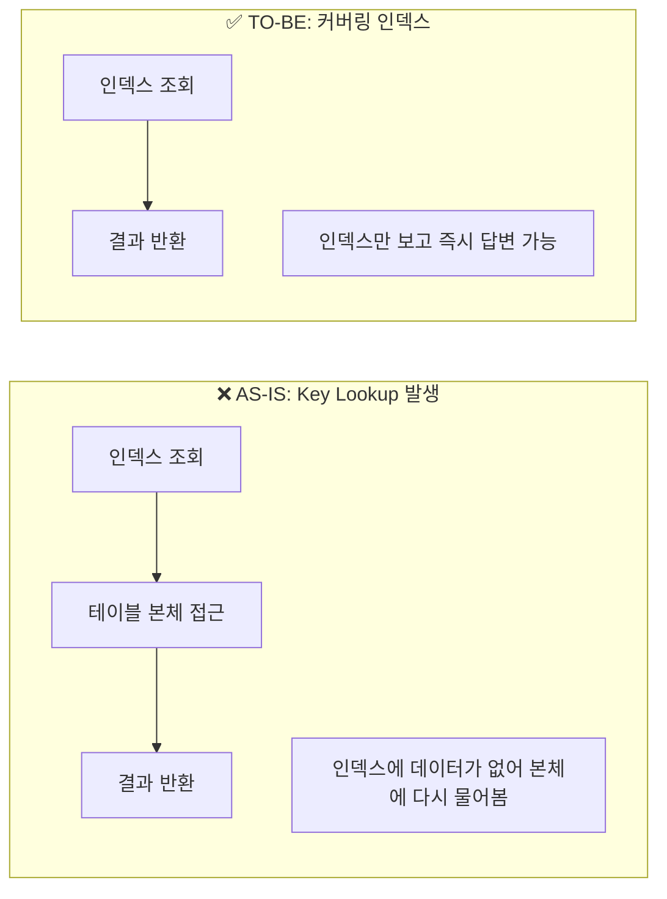

# [페이레터] 빌링 테이블 인덱스 최적화 및 성능 저하 해결

### 🏢 소속 / 기간
- **회사**: 페이레터㈜ (플랫폼기술팀)
- **기간**: 2018.09 ~ 2022.06

### ❓ 문제 상황 (Challenge)

#### 1. 배경 및 초기 상태
결제 시스템의 핵심인 `cash` 테이블은 결제 번호(`cashno`)를 PK로 가지며, 수백만 건의 데이터가 축적된 상태였습니다.

```sql
-- [초기 cash 테이블 DDL 예시]
CREATE TABLE cash (
    cashno INT PRIMARY KEY,        -- 결제 번호 (Clustered Index)
    userid VARCHAR(50),            -- 사용자 ID
    amount INT,                    -- 결제 금액
    status TINYINT,                -- 상태 (결제완료, 취소 등)
    reg_datetime DATETIME          -- 등록 일시
);
```

#### 2. 성능 최적화 시도 (인덱스 추가)
특정 기간의 결제 내역 조회가 빈번해짐에 따라, `reg_datetime` 컬럼의 조회 성능을 향상시키기 위해 **비클러스터형 인덱스(Non-Clustered Index)**를 신규 생성했습니다.

```sql
-- [reg_datetime 인덱스 생성]
CREATE INDEX IX_CASH_REGDT ON cash(reg_datetime);
```

#### 3. 예기치 못한 성능 저하 발생
인덱스 생성 직후, 기존에 잘 동작하던 조회 쿼리들의 성능이 갑자기 급격히 저하되었습니다. 쿼리문은 동일했으나, DB의 **Optimizer(CBO)**가 예상과 다른 실행 계획을 선택하면서 시스템 전반의 응답 속도가 느려지는 이슈가 발생했습니다.

### 🔍 원인 분석 (Root Cause)

#### 📊 Optimizer 실행 계획 (AS-IS vs TO-BE)

```mermaid
graph TD
    subgraph "❌ AS-IS: 비효율적인 실행 계획 (Key Lookup)"
        A1[SELECT 쿼리 시작] --> B1{Optimizer의 선택}
        B1 -->|비용 오판| C1[IX_CASH_REGDT 인덱스 스캔]
        C1 --> D1[찾은 각 행마다 RID/PK 추출]
        D1 --> E1["PK_CASH (Clustered Index) 접근"]
        E1 --> F1[실제 데이터 페이지 로드 - Key Lookup]
        F1 --> G1[결과 반환]
        
        style E1 fill:#f96,stroke:#333,stroke-width:2px
        style F1 fill:#f96,stroke:#333,stroke-width:2px
    end

    subgraph "✅ TO-BE: 효율적인 실행 계획 (Covering Index)"
        A2[SELECT 쿼리 시작] --> B2{Optimizer의 선택}
        B2 -->|최적 경로| C2[IX_CASH_REGDT_COVERING 인덱스 스캔]
        C2 --> D2[인덱스 내 INCLUDE된 데이터 즉시 추출]
        D2 --> E2[결과 반환]
        
        style C2 fill:#6cf,stroke:#333,stroke-width:2px
        style D2 fill:#6cf,stroke:#333,stroke-width:2px
    end
```


#### 1. Optimizer의 실행 계획 변동 (Execution Plan Change)
- **핵심 원인**: "인덱스를 추가했을 뿐인데 왜 느려졌는가?"에 대한 근본적인 이유입니다.
- **현상**: 새로운 인덱스가 생성되면 DB의 Optimizer는 이를 활용할 수 있는 새로운 경로를 계산합니다. 이때 **통계 정보(Statistics)**가 최신화되지 않았거나, Optimizer가 인덱스 스캔 후 발생하는 **Key Lookup 비용**을 과소평가하여 잘못된 실행 계획을 수립할 수 있습니다.
- **Key Lookup의 함정**: `reg_datetime` 인덱스에는 찾고자 하는 실제 데이터(금액, 상태 등)가 없습니다. 따라서 인덱스에서 위치를 찾은 뒤, 다시 테이블 본체(Clustered Index)로 가서 데이터를 가져오는 'Key Lookup' 작업이 데이터 건수만큼 반복됩니다. 
    - **비용의 핵심 (Random I/O)**: 인덱스는 정렬되어 있어 연속적으로 읽을 수 있지만, 실제 데이터 페이지는 디스크 여기저기에 흩어져 있습니다. 따라서 Key Lookup은 디스크 헤더가 물리적으로 계속 움직여야 하는 **Random I/O**를 유발하며, 이는 순차 읽기보다 수십 배 이상의 비용이 듭니다.
    - **이중 오버헤드**: 인덱스 페이지를 읽는 CPU/IO 비용 + 실제 데이터 페이지를 읽는 CPU/IO 비용이 합쳐져 전체 쿼리 비용이 폭증합니다.
- **임계치(Tipping Point)**: 보통 조회하려는 데이터가 전체의 3~5%를 넘어가면 인덱스를 타는 것보다 테이블 전체를 읽는(Full Scan) 것이 더 빠릅니다. 하지만 Optimizer가 이 지점을 잘못 판단하여 수만 건의 Random I/O를 유발하는 인덱스 경로를 선택하면서 성능이 급격히 저하되었습니다.

#### 2. 통계 정보의 결정적 역할 (Role of Statistics)
- **핵심 지표**: Optimizer가 실행 계획을 세울 때 참조하는 데이터의 '지도'와 같습니다.
    - **행 수(Row Count)**: 테이블이나 인덱스에 포함된 전체 레코드 수.
    - **밀도(Density)**: 컬럼 값의 중복도. 밀도가 낮을수록(유니크할수록) 인덱스 효율이 높다고 판단합니다.
    - **히스토그램(Histogram)**: 특정 컬럼 값의 분포도. (예: 2021년 데이터는 전체의 10%, 2022년 데이터는 80% 등)
- **신규 인덱스 생성 후의 통계 상태 (추측)**:
    - 인덱스를 처음 생성하면 DB 엔진은 전체 데이터를 훑으며 **최신 통계(Full Scan Statistics)**를 생성합니다.
    - **문제 발생 시나리오**: 최신 통계임에도 불구하고, Optimizer가 `reg_datetime` 인덱스의 히스토그램을 보고 "어? 특정 날짜 데이터가 전체의 1%밖에 안 되네? 인덱스를 타면 아주 빠르겠는걸?"이라고 **오판**할 수 있습니다. 
    - 하지만 실제로는 인덱스에 없는 컬럼을 가져오기 위한 **Key Lookup 비용(Random I/O)**이 테이블 전체를 읽는 비용보다 훨씬 컸기 때문에 성능이 저하된 것입니다. 즉, 통계 정보는 정확했으나 **Optimizer가 I/O 비용 계산 로직에서 실수**를 범한 사례입니다.

#### 3. 통계 정보 최신화의 중요성
- 인덱스 생성 후 Optimizer가 해당 인덱스의 데이터 분포를 정확히 참조할 수 있도록 통계 정보를 관리해야 함.

### 🛠 해결 방안 (Action)

#### 1. 인덱스 힌트(Index Hint) 적용 (긴급 처방)
- Optimizer가 엉뚱한 인덱스를 타지 못하도록 쿼리에 `WITH (INDEX(PK_CASH))`와 같이 사용할 인덱스를 직접 지정했습니다.
- 이를 통해 즉각적으로 성능을 정상화시켰습니다.

#### 2. 커버링 인덱스(Covering Index) 도입 (근본 해결)
- 인덱스 뒷부분에 자주 조회되는 컬럼들을 포함(`INCLUDE`)시켜, 인덱스만 보고도 모든 데이터를 알 수 있게 만들었습니다.
- 테이블 본체를 다시 뒤질 필요가 없으므로(**Key Lookup 제거**), I/O 부하가 획기적으로 줄어듭니다.

```sql
-- [커버링 인덱스 적용]
CREATE INDEX IX_CASH_REGDT_COVERING ON cash(reg_datetime) 
INCLUDE (userid, amount, status); -- 필요한 컬럼을 인덱스 페이지에 포함
```

#### 📊 Key Lookup vs 커버링 인덱스 비교


#### 3. 주기적인 실행 계획 모니터링 및 통계 갱신
- 데이터 변경량이 많은 테이블은 주기적으로 **통계 정보**를 최신으로 유지하여 Optimizer가 똑똑한 판단을 내릴 수 있도록 관리했습니다.


### ✨ 성과 및 결과 (Result)
- **조회 성능 회복 및 최적화**: 커버링 인덱스 적용 후 쿼리 응답 속도가 인덱스 생성 전 대비 약 5배 이상 향상됨.
- **시스템 안정성 확보**: 급격한 I/O 부하 문제를 해결하여 피크 타임 시 빌링 시스템의 안정적인 서비스 가능.
- **DB 튜닝 역량 내재화**: 인덱스 설계 시 단순히 컬럼을 추가하는 것을 넘어, 실행 계획과 I/O 비용을 고려한 최적화 프로세스 정립.

---

#### 6. 인덱스 생성 후 통계 정보가 즉시 반영될까? (FAQ)
- **상태**: 인덱스를 생성하면 DB 엔진은 일반적으로 **Full Scan**을 통해 아주 상세한 통계 정보를 즉시 생성합니다.
- **오판의 이유**: 통계 정보가 최신임에도 불구하고 문제가 발생하는 이유는, Optimizer가 통계상의 '데이터 건수'만 보고 **'Key Lookup에 따르는 Random I/O 비용'**을 실제보다 낮게 평가하기 때문입니다. 
- **결론**: 통계 갱신은 기본이며, 실행 계획을 직접 확인하여 **Tipping Point**를 넘지 않는지 체크하는 것이 더 중요합니다.

### 💡 운영 DB 인덱스 설정 시 고려사항 (Best Practices)

운영 중인 대규모 데이터베이스에 인덱스를 추가할 때는 서비스 중단을 방지하고 성능 저하를 최소화하기 위해 다음 사항들을 준수해야 합니다.

#### 1. 온라인 인덱스 생성 (Online Index Create)
- **문제**: 일반적인 인덱스 생성은 테이블에 공유 잠금(S-Lock)을 걸어 데이터 변경(Insert/Update/Delete)을 차단할 수 있습니다.
- **해결**: SQL Server의 `WITH (ONLINE = ON)`이나 PostgreSQL의 `CONCURRENTLY` 옵션을 사용하여, 서비스 중단 없이 인덱스를 생성해야 합니다.

#### 2. 실행 계획 사전 검증 (Staging/Test)
- **문제**: 운영 환경과 데이터 분포가 다른 개발 환경에서의 테스트는 실행 계획 오판을 잡아내기 어렵습니다.
- **해결**: 운영 데이터의 통계 정보나 샘플 데이터를 복제한 환경에서 **실행 계획(Execution Plan)**을 반드시 사전에 확인하여, Key Lookup 폭증이나 엉뚱한 인덱스 선택 가능성을 체크해야 합니다.

#### 3. 통계 정보 최신화 (Update Statistics)
- **문제**: 인덱스 생성 직후에는 DB 엔진이 해당 인덱스의 데이터 분포를 정확히 모를 수 있습니다.
- **해결**: 인덱스 생성 후 즉시 관련 테이블의 **통계 정보를 갱신**하여 Optimizer가 올바른 판단을 내릴 수 있도록 지원해야 합니다.

#### 4. 단계적 적용 및 모니터링
- **문제**: 한꺼번에 많은 인덱스를 추가하면 쓰기 성능 저하 및 예기치 못한 실행 계획 변동이 발생할 수 있습니다.
- **해결**: 가장 필요한 인덱스부터 하나씩 추가하며, 적용 전후의 CPU, I/O, Slow Query 발생 여부를 실시간으로 모니터링해야 합니다.

#### 5. 커버링 인덱스 우선 고려
- **문제**: 단순 인덱스는 이번 사례처럼 Key Lookup 비용으로 인해 오히려 독이 될 수 있습니다.
- **해결**: 자주 조회되는 컬럼이 명확하다면 처음부터 `INCLUDE` 구문을 활용한 **커버링 인덱스** 설계를 우선적으로 검토하여 I/O 효율을 극대화합니다.
