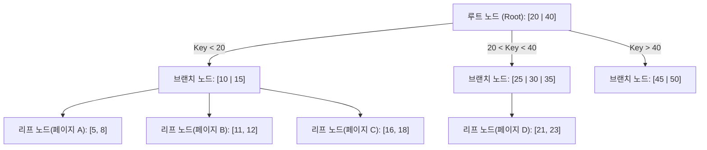
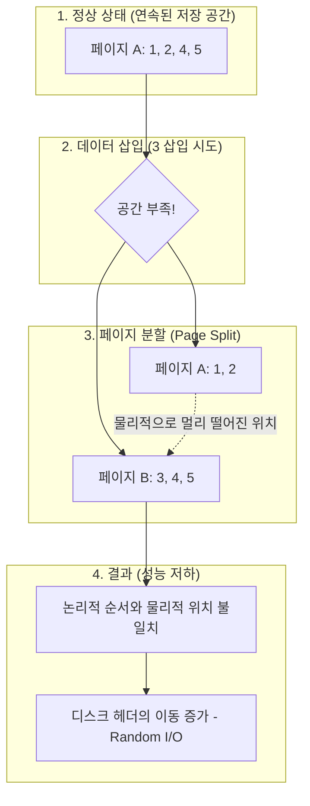
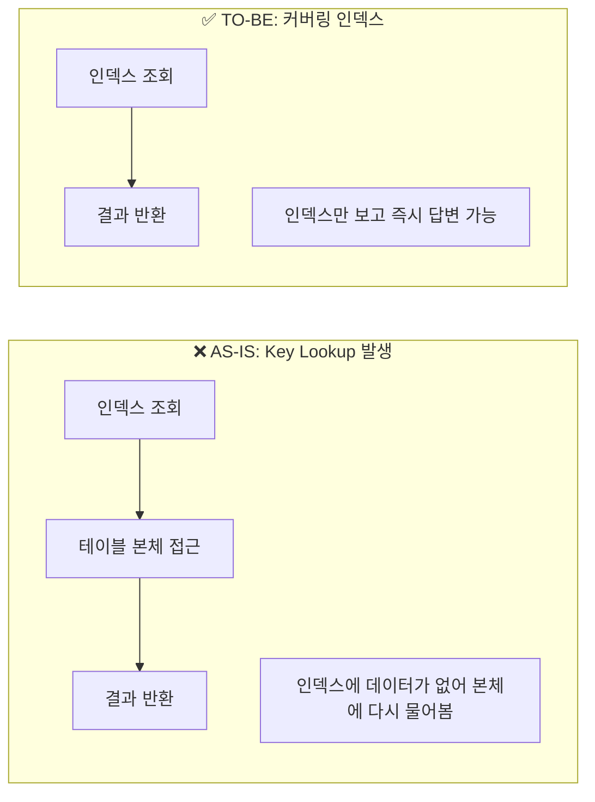

# [페이레터] 빌링 테이블 인덱스 최적화 및 성능 저하 해결

### 🏢 소속 / 기간
- **회사**: 페이레터㈜ (플랫폼기술팀)
- **기간**: 2018.09 ~ 2022.06

### ❓ 문제 상황 (Challenge)
- **현상**: 결제 데이터가 축적된 `cash` 테이블(`cashno`가 Clustered Index/PK인 상태)의 `reg_datetime`(등록 일시) 컬럼에 조회 성능 향상을 위해 비클러스터형 인덱스(Non-Clustered Index)를 신규 생성함.
- **문제**: 인덱스 생성 후, 기존에 잘 동작하던 쿼리들의 성능이 갑자기 급격히 저하되는 현상 발생.
- **특이사항**: 쿼리문 자체의 변경은 없었으며, 단순 인덱스 추가만으로 Optimizer가 비효율적인 실행 계획을 선택하여 시스템 전반의 응답 속도가 느려짐.

### 🔍 원인 분석 (Root Cause)

#### 1. Optimizer의 실행 계획 변동 (Execution Plan Change)
- **핵심 원인**: "인덱스를 추가했을 뿐인데 왜 느려졌는가?"에 대한 근본적인 이유입니다.
- **현상**: 새로운 인덱스가 생성되면 DB의 Optimizer는 이를 활용할 수 있는 새로운 경로를 계산합니다. 이때 **통계 정보(Statistics)**가 최신화되지 않았거나, Optimizer가 인덱스 스캔 후 발생하는 **Key Lookup 비용**을 과소평가하여 잘못된 실행 계획을 수립할 수 있습니다.
- **Key Lookup의 함정**: `reg_datetime` 인덱스에는 찾고자 하는 실제 데이터(금액, 상태 등)가 없습니다. 따라서 인덱스에서 위치를 찾은 뒤, 다시 테이블 본체(Clustered Index)로 가서 데이터를 가져오는 'Key Lookup' 작업이 데이터 건수만큼 반복됩니다. 
- **임계치(Tipping Point)**: 보통 조회하려는 데이터가 전체의 3~5%를 넘어가면 인덱스를 타는 것보다 테이블 전체를 읽는(Full Scan) 것이 더 빠릅니다. 하지만 Optimizer가 이 지점을 잘못 판단하여 수만 건의 Random I/O를 유발하는 인덱스 경로를 선택하면서 성능이 급격히 저하되었습니다.

#### 2. 신규 비클러스터형 인덱스의 파편화 (Index Fragmentation)
- **보조 원인**: 실행 계획이 바뀐 상태에서, 새로 생성된 인덱스 공간마저 물리적으로 효율적이지 못해 성능 저하를 가속화시켰습니다.
    - DB 인덱스는 주로 **B-Tree(Balanced Tree)** 구조로 관리됩니다.
    - `reg_datetime` 컬럼에 인덱스를 생성하면, DB는 이 시간 순서대로 정렬된 **새로운 인덱스 전용 공간(B-Tree 노드/페이지들)**을 만듭니다.

#### 📊 B-Tree 구조와 인덱스 페이지

- **파편화 발생 원인**: 
    - 데이터가 1초에 수백 건씩 마구 들어오거나, 과거 데이터가 수정/삭제되면 위 그림의 **리프 노드(페이지)들** 사이사이에 새로운 데이터를 끼워 넣어야 합니다.
    - 이때 공간이 부족하면 페이지가 쪼개지는 **Page Split**이 발생하며, 물리적으로 멀리 떨어진 곳에 새 페이지가 생깁니다.
    - 결국, 새로 만든 인덱스 자체가 이미 '누더기'처럼 파편화되어 있어, 인덱스를 읽는 것 자체가 느려지게 됩니다.
- **비유**: 새 책꽂이(신규 인덱스)를 샀는데, 책을 순서대로 꽂는 도중에 자리가 모자라서 여기저기 빈 칸에 억지로 끼워 넣다 보니 나중에는 책 한 권 찾으려고 책꽂이 전체를 뒤져야 하는 상황입니다.
- **결과**: 인덱스를 읽을 때 디스크 헤드가 물리적으로 멀리 떨어진 곳을 왔다 갔다 해야 하므로(**Random I/O**), 조회 속도가 급격히 느려집니다.

#### 📊 인덱스 파편화 및 페이지 분할 과정

#### 3. 통계 정보의 불일치
- 인덱스 생성 직후 통계 정보가 최신화되지 않아, Optimizer가 잘못된 비용 계산을 바탕으로 비효율적인 실행 계획을 수립함.

### 🛠 해결 방안 (Action)

#### 1. 인덱스 힌트(Index Hint) 적용 (긴급 처방)
- Optimizer가 엉뚱한 인덱스를 타지 못하도록 쿼리에 `WITH (INDEX(PK_CASH))`와 같이 사용할 인덱스를 직접 지정했습니다.
- 이를 통해 즉각적으로 성능을 정상화시켰습니다.

#### 2. 커버링 인덱스(Covering Index) 도입 (근본 해결)
- 인덱스 뒷부분에 자주 조회되는 컬럼들을 포함(`INCLUDE`)시켜, 인덱스만 보고도 모든 데이터를 알 수 있게 만들었습니다.
- 테이블 본체를 다시 뒤질 필요가 없으므로(**Key Lookup 제거**), I/O 부하가 획기적으로 줄어듭니다.

#### 📊 Key Lookup vs 커버링 인덱스 비교

#### 3. 주기적인 인덱스 관리 및 통계 갱신
- 파편화된 인덱스를 다시 정렬하는 **Rebuild** 작업을 자동화하고, DB가 똑똑한 판단을 내릴 수 있도록 **통계 정보**를 최신으로 유지했습니다.

### ✨ 성과 및 결과 (Result)
- **조회 성능 회복 및 최적화**: 커버링 인덱스 적용 후 쿼리 응답 속도가 인덱스 생성 전 대비 약 5배 이상 향상됨.
- **시스템 안정성 확보**: 급격한 I/O 부하 문제를 해결하여 피크 타임 시 빌링 시스템의 안정적인 서비스 가능.
- **DB 튜닝 역량 내재화**: 인덱스 설계 시 단순히 컬럼을 추가하는 것을 넘어, 실행 계획과 I/O 비용을 고려한 최적화 프로세스 정립.
