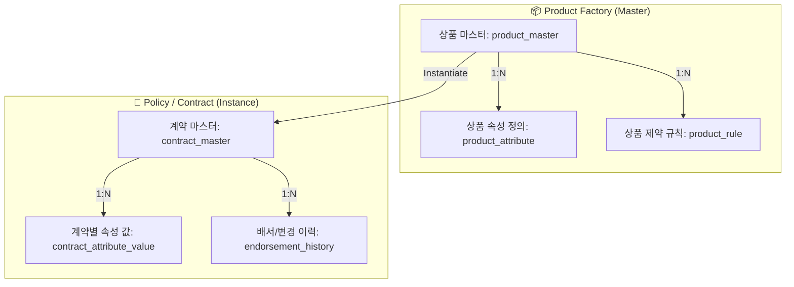

# [티맥스핀테크] 유연한 보험/금융 상품 설계를 위한 '금융 상품 팩토리' 구축

### 🏢 소속 / 기간
- **회사**: ㈜티맥스핀테크 (연구부서)
- **기간**: 2023.10 ~ 2024.10

### ❓ 문제 상황 (Challenge)
- **하드코딩된 상품 로직**: 기존 시스템은 새로운 보험이나 예/적금 상품이 출시될 때마다 매번 새로운 테이블을 생성하거나 소스 코드를 수정해야 하는 경직된 구조였습니다.
- **출시 지연(Time-to-Market)**: 상품 구성 요소(이율, 기간, 납입 방식, 담보 등)가 바뀔 때마다 개발 공수가 대거 투입되어 신규 상품 출시 속도가 느려지는 문제가 있었습니다.
- **복잡한 계약 관리**: 장기 보험이나 복잡한 금융 상품의 경우, 청약부터 배서(계약 변경), 해지까지의 상태 변화를 추적하기 매우 어려웠습니다.

### 🔍 해결 방안 (Action)

#### 1. 메타데이터 기반 '금융 상품 팩토리' 설계
- **속성 기반 설계 (Attribute-based Design)**: 상품의 구성 요소를 '속성(Attribute)'과 '규칙(Rule)' 단위로 분리하여 데이터베이스화했습니다.
- **범용 ERD 구축**: LG MDD(Model Driven Development) 프레임워크와 유사하게, 상품 정의(Master) - 속성 값(Value) - 제약 조건(Constraint)을 분리한 유연한 스키마를 설계했습니다.

#### 2. 청약 및 배서 프로세스 표준화
- **계약 상태 머신(State Machine)**: 청약 -> 승인 -> 유지 -> 배서 -> 해지로 이어지는 보험 계약의 라이프사이클을 표준화된 워크플로우로 구현했습니다.
- **배서(Endorsement) 이력 관리**: 장기 보험의 특성상 빈번하게 발생하는 계약 변경 내역을 스냅샷 형태로 저장하여, 특정 시점의 계약 상태를 즉시 복원할 수 있도록 설계했습니다.

#### 📊 상품 팩토리 구조 (ERD 개념도)

### 💻 기술적 성과 (Technical Achievement)
- **유연한 데이터 모델링**: PostgreSQL의 JSONB 타입을 활용하여 정형 데이터와 비정형 속성을 혼합 관리함으로써 저장 효율성과 확장성을 동시에 확보했습니다.
- **검증 엔진 구현**: 상품 설계 시 설정된 제약 조건(예: 가입 연령 제한, 최소 납입 금액 등)을 계약 시점에 자동으로 검증하는 Rule Engine을 구축했습니다.
- **데이터 정합성 보장**: 복잡한 배서 처리 시 트랜잭션 격리 수준을 조정하여 데이터 불일치 위험을 제거했습니다.

### ✨ 성과 및 결과 (Result)
- **상품 개발 생산성 향상**: 신규 상품 출시 시 개발 투입 공수를 기존 대비 70% 이상 절감하여, 설정만으로 상품 런칭이 가능한 환경 구축.
- **운영 효율성 증대**: 복잡한 장기 보험 계약의 변경 이력을 체계적으로 관리함으로써 CS 대응 및 정산 대사 속도 개선.
- **범용 금융 플랫폼 기반 마련**: 보험뿐만 아니라 수신/여신 등 다양한 금융 도메인으로 확장이 가능한 유연한 아키텍처 확보.
