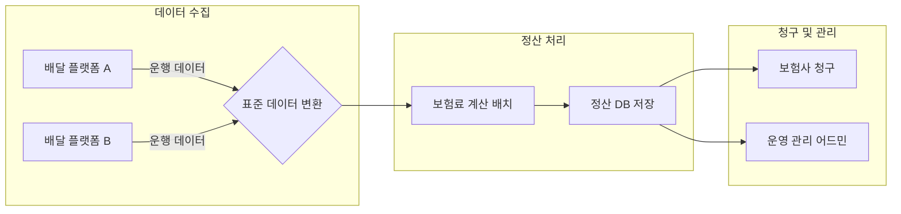

# [티맥스핀테크] 배달공제조합 시간제 보험 정산 시스템 구축

### 🏢 소속 / 기간
- **회사**: ㈜티맥스핀테크 (연구부서 선임/팀장)
- **기간**: 2023.10 ~ 2024.10

### ❓ 문제 상황 (Challenge)
- 배달 플랫폼별(배달의민족, 쿠팡이츠 등)로 라이더의 운행 데이터와 보험료 정산 방식이 상이하여 통합 관리가 어려움.
- 수만 명의 라이더에 대해 분 단위로 발생하는 시간제 보험료를 정확하고 신속하게 계산하여 청구해야 하는 복잡한 정산 프로세스 필요.

### 🛠 해결 방안 (Action)
- **정산 프로세스 표준화**: 각 플랫폼의 상이한 데이터를 하나의 공통 규격으로 통합 처리하는 배치(Batch) 프로그램 설계.
- **API 연동 설계**: 배달 시작/종료 시점의 실시간 운행 데이터를 수신하고, 사고 발생 시 즉각적으로 대응할 수 있는 연동 API 구축.
- **범용 ERD 설계**: 다양한 여신/수신 상품 및 정산 구조를 유연하게 수용할 수 있는 상품 팩토리 구조의 DB 설계.

#### 📊 정산 시스템 흐름도 (Mermaid)
복잡한 데이터를 수집하여 정산 및 청구까지 이어지는 일련의 과정입니다.

### ✨ 성과 및 결과 (Result)
- **운영 효율성 극대화**: 수동으로 처리하던 정산 업무를 자동화하여 정산 소요 시간을 80% 이상 단축.
- **데이터 정합성 확보**: 플랫폼별 데이터 차이를 극복하고 99.9% 이상의 정산 정확도 달성.
- **확장성 있는 시스템**: 신규 배달 플랫폼이나 보험 상품 추가 시에도 코드 수정 최소화로 대응 가능한 유연한 아키텍처 구축.
